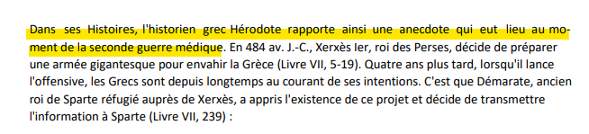

# NicePDF 

On prend la première phrase du PDF.

 


```DansHseseHistoires,rl'historienogrec{HérodoteErapporte4ainsiSuneYanecdote_quiPeutDlieuFau}moment de la seconde guerre médique```

**Flag : Hero{E4SY_PDF}**
