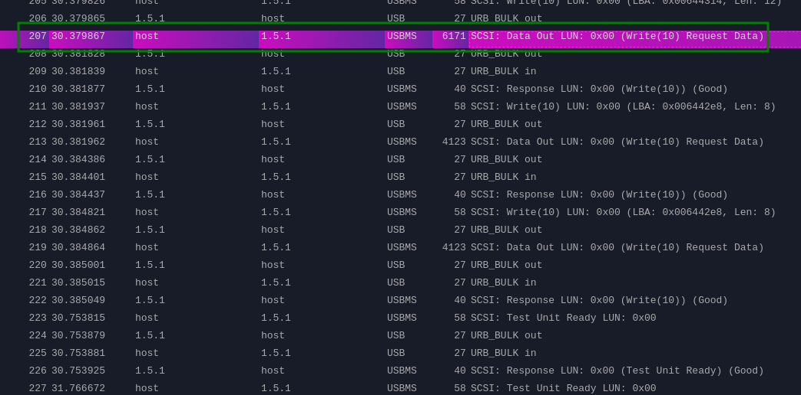
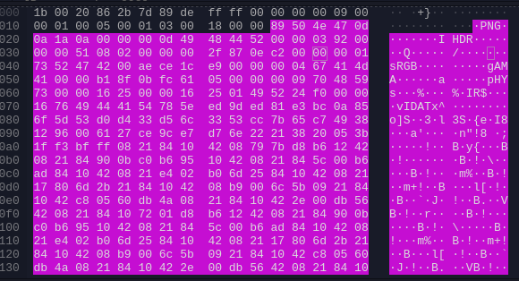

# La livraison de pizza

## Enoncé

> Un nouvel employé travaille tranquillement à son bureau, quand quelqu'un se présente devant pour 'Livraison de galettes saucisses'. Il est nouveau, mais il se dit qu'en Bretagne, après tout, cela doit arriver.
> 
> Il est donc venu dans votre bureau vous demandez si vous aviez commandé, mais votre réponse est non. Il revient tout paniqué en vous disant que son anvitirus a enregistré un traffic USB inhabituel.
> 
> L'anvitirus de votre entreprise est configuré pour prendre des dumps réseaux de tout le traffic, même le traffic USB ! A vous de l'analyser pour voir ce qu'il s'est passé.

## Solve

On a un fichier **pcapng** à analyser, on ouvre donc le fichier avec wireshark

On regarde un peu les requêtes, on remarque une requête d'une taille important par rapport aux autres

On remarque dans les données **png**

Il suffit d'exporter les données `fichier > exporter paquet octet > flag.png`

**flag : BZHCTF{pc4png_0n_usb_tr4ff1c_1s_34sy}**
