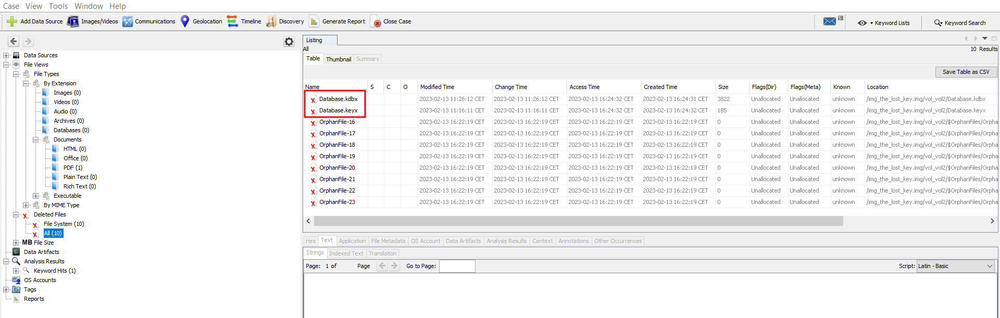
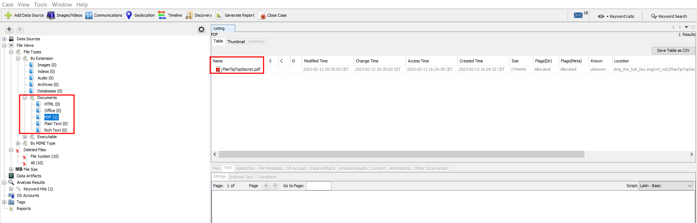
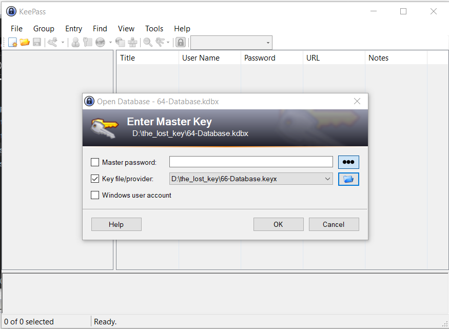
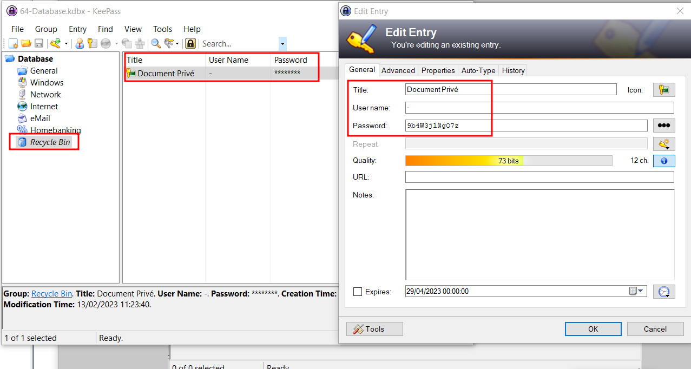
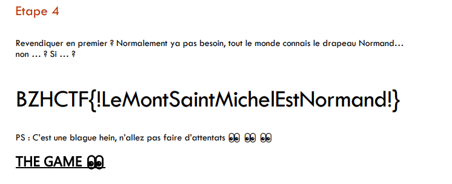

# The Lost Key

Difficulté : Facile

Auteur: Zeecka

## Énoncé

> La clé USB d'un terroriste normand a été récupérée. Investiguez son support pour l'empêcher de passer à l'acte !

## Solve

```shell
tar xzvf the_lost_key.tar.gz
the_lost_key.img
```

Un `file` & `fdisk` pour obtenir des informations sur le dump :

```shell
file the_lost_key.img 
the_lost_key.img: DOS/MBR boot sector; partition 1 : ID=0x7, start-CHS (0x4,4,1), end-CHS (0x3ff,254,2), startsector 2048, 3909632 sectors
```

```shell
fdisk -l the_lost_key.img 
Disque the_lost_key.img : 1,87 GiB, 2003632128 octets, 3913344 secteurs
Unités : secteur de 1 × 512 = 512 octets
Taille de secteur (logique / physique) : 512 octets / 512 octets
taille d'E/S (minimale / optimale) : 512 octets / 512 octets
Type d'étiquette de disque : dos
Identifiant de disque : 0x7bdf73d0

Périphérique            Amorçage Début     Fin Secteurs Taille Id Type
the_lost_key.img1           2048 3911679  3909632   1,9G  7 HPFS/NTFS/exFAT
```

On va ouvrir dans **Autopsy** le dump, le dump ne contient pas beaucoup de document. On peut récupérer un PDF avec un nom plutôt intéréssant protégé par un mot de passe :



Dans les fichiers supprimés, on a une DB Keepass et sa master key :



On ouve le keepass :



Dans la corbeille, on découvre le mot de passe du PDF :



On ouvre le document PDF avec le mot de passe et on a le flag :



**Flag : BZHCTF{!LeMontSaintMichelEstNormand!}**
