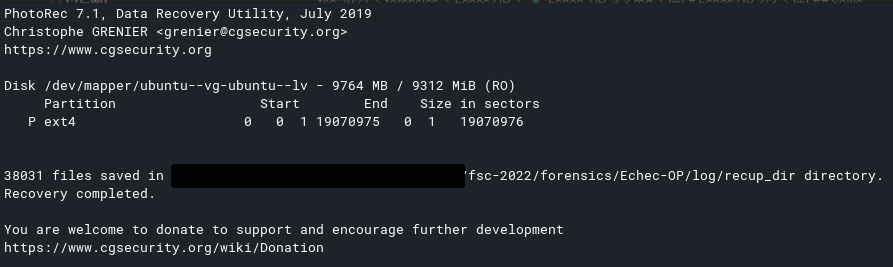

# Échec OP

Catégorie : Forensics

## Échec OP 0/3

Difficulté : :star:

### Ennoncé

> Quel est l'identifiant unique (UUID) de la table de partition de ce disque ? Une fois que vous l'aurez trouvé, encadrez le dans FCSC{} pour obtenir le flag. Par exemple FCSC{1111-2222-3333-4444}.
> 
> SHA256(fcsc.7z) = fe23478be033fb87db95313650619d95a3756d90d272e82887d70936c7700f5c (5.4GB).
> SHA256(fcsc.raw) = 18b33658c9fc8e81666f04999bd38cb6709c6a7399d8a43a72028caa278067bf (10GB).
> Note : le fichier fcsc.7z est le même pour tous les challenges Echec OP.

### Solve

```shell
fdisk -l fcsc.raw
Disk fcsc.raw: 10 GiB, 10737418240 bytes, 20971520 sectors
Units: sectors of 1 * 512 = 512 bytes
Sector size (logical/physical): 512 bytes / 512 bytes
I/O size (minimum/optimal): 512 bytes / 512 bytes
Disklabel type: gpt
Disk identifier: 60DA4A85-6F6F-4043-8A38-0AB83853E6DC

Device       Start      End  Sectors  Size Type
fcsc.raw1     2048     4095     2048    1M BIOS boot
fcsc.raw2     4096  1861631  1857536  907M Linux filesystem
fcsc.raw3  1861632 20969471 19107840  9,1G Linux filesystem
```

**Flag : FCSC{60DA4A85-6F6F-4043-8A38-0AB83853E6DC}**

---

## Échec OP 1/3

Difficulté : :start:

### Ennoncé

> L'administrateur de ce serveur a chiffré son disque, le mot de passe est fcsc2022.
> 
> Quelle est la date de la création du système de fichiers en UTC ?
> 
> Le flag est au format ISO 8601, tel que dans l'exemple suivant : FCSC{2022-04-22T06:59:59Z}.
> 
> SHA256(fcsc.7z) = fe23478be033fb87db95313650619d95a3756d90d272e82887d70936c7700f5c (5.4GB).
> SHA256(fcsc.raw) = 18b33658c9fc8e81666f04999bd38cb6709c6a7399d8a43a72028caa278067bf (10GB).
> Note : le fichier fcsc.7z est le même pour tous les challenges Echec OP.

### Solve

```shell
file fcsc.raw 
fcsc.raw: DOS/MBR boot sector, extended partition table (last)

fdisk -l fcsc.raw 
Disk fcsc.raw: 10 GiB, 10737418240 bytes, 20971520 sectors
Units: sectors of 1 * 512 = 512 bytes
Sector size (logical/physical): 512 bytes / 512 bytes
I/O size (minimum/optimal): 512 bytes / 512 bytes
Disklabel type: gpt
Disk identifier: 60DA4A85-6F6F-4043-8A38-0AB83853E6DC

Device       Start      End  Sectors  Size Type
fcsc.raw1     2048     4095     2048    1M BIOS boot
fcsc.raw2     4096  1861631  1857536  907M Linux filesystem
fcsc.raw3  1861632 20969471 19107840  9,1G Linux filesystem

dd if=fcsc.raw of=partition3-file skip=1861632 count=19107840 status=progress
9703326208 octets (9,7 GB, 9,0 GiB) copiés, 67 s, 145 MB/s
19107840+0 enregistrements lus
19107840+0 enregistrements écrits
9783214080 octets (9,8 GB, 9,1 GiB) copiés, 67,4989 s, 145 MB/s

sudo mount partition3-file mountpoint
mount: /home/zarkyo/FCSC/Echec-OP/mountpoint: unknown filesystem type 'crypto_LUKS'.

sudo cryptsetup open partition3-file datafcsc
Saisissez la phrase secrète pour partition3-file : fcsc2022

└─$ lsblk
NAME                      MAJ:MIN RM   SIZE RO TYPE  MOUNTPOINTS
loop0                       7:0    0   9,1G  0 loop  
└─datafcsc                254:0    0   9,1G  0 crypt 
  └─ubuntu--vg-ubuntu--lv 254:1    0   9,1G  0 lvm   
nvme0n1                   259:0    0 238,5G  0 disk  
├─nvme0n1p1               259:1    0   260M  0 part  /boot/efi
├─nvme0n1p2               259:2    0    16M  0 part  
├─nvme0n1p3               259:3    0 159,1G  0 part  
├─nvme0n1p4               259:4    0  78,1G  0 part  /
└─nvme0n1p5               259:5    0   977M  0 part  [SWAP]

└─$ sudo mount /dev/mapper/ubuntu--vg-ubuntu--lv /media/datafcsc 

mkdir data
sudo cp -r /media/datafcsc/* data/

stat datafcsc    
  Fichier : datafcsc
   Taille : 4096        Blocs : 8          Blocs d E/S : 4096   répertoire
Périphérique : fe01h/65025d     Inœud : 2           Liens : 19
Accès : (0755/drwxr-xr-x)  UID : (    0/    root)   GID : (    0/    root)
 Accès : 2022-04-30 13:16:27.821728656 +0200
Modif. : 2022-03-27 05:47:14.900026411 +0200
Changt : 2022-03-27 05:47:14.900026411 +0200
  Créé : 2022-03-27 05:44:49.000000000 +0200
```

Le flag est demandé en UTC donc en enlève 2h 

**Flag : FCSC{2022-03-27T03:44:49Z}**

---

## Échec OP 2/3

Difficulté : :star:

### Ennoncé

> Retrouvez le mot de passe de l'utilisateur principal de ce serveur. La force ne résout pas tout... Le mot de passe correspond au flag, entouré de FCSC{}, par exemple : FCSC{password}. Aussi, l'administrateur de ce serveur a chiffré son disque et le mot de passe est fcsc2022.
> 
> SHA256(fcsc.7z) = fe23478be033fb87db95313650619d95a3756d90d272e82887d70936c7700f5c (5.4GB).
> SHA256(fcsc.raw) = 18b33658c9fc8e81666f04999bd38cb6709c6a7399d8a43a72028caa278067bf (10GB).
> Note : le fichier fcsc.7z est le même pour tous les challenges Echec OP.
> Le disque est chiffré, le mot de passe est fcsc2022.

### Solve

```shell
sudo cat etc/shadow

root:*:19046:0:99999:7:::
daemon:*:19046:0:99999:7:::
bin:*:19046:0:99999:7:::
sys:*:19046:0:99999:7:::
sync:*:19046:0:99999:7:::
games:*:19046:0:99999:7:::
man:*:19046:0:99999:7:::
lp:*:19046:0:99999:7:::
mail:*:19046:0:99999:7:::
news:*:19046:0:99999:7:::
uucp:*:19046:0:99999:7:::
proxy:*:19046:0:99999:7:::
www-data:*:19046:0:99999:7:::
backup:*:19046:0:99999:7:::
list:*:19046:0:99999:7:::
irc:*:19046:0:99999:7:::
gnats:*:19046:0:99999:7:::
nobody:*:19046:0:99999:7:::
systemd-network:*:19046:0:99999:7:::
systemd-resolve:*:19046:0:99999:7:::
systemd-timesync:*:19046:0:99999:7:::
messagebus:*:19046:0:99999:7:::
syslog:*:19046:0:99999:7:::
_apt:*:19046:0:99999:7:::
tss:*:19046:0:99999:7:::
uuidd:*:19046:0:99999:7:::
tcpdump:*:19046:0:99999:7:::
landscape:*:19046:0:99999:7:::
pollinate:*:19046:0:99999:7:::
usbmux:*:19078:0:99999:7:::
sshd:*:19078:0:99999:7:::
systemd-coredump:!!:19077::::::
obob:$6$cvD51kQkFtMohr9Q$vE2L5CUX3jDZgVUZGOFNUFsSHGomH/EP5yYQA3dcKMm9U00mvA9pLzo7Z.Ki6exchu29jEENxtBdGUXCISNxL0:19078:0:99999:7:::
lxd:!:19078::::::
```

On suppose qu'il faut récupérer le password du user obob, sans le brute force d'après l'énnoncé

```
sudo cat home/obob/.bash_history                     

exit
w
ls
perfect opsec
sudo -su -
sudo su -
exit
cd pkpas/
ls
cd big-list-of-naughty-strings/
git pull
git status
git log
cd
ls
w
exit
shutdown 
```

On remarque qu'il a élevé ses privilèges en root `sudo su -`

```
sudo cat root/.bash_history
exit
passwd obob 
CZSITvQm2MBT+n1nxgghCJ
exit
```

**Flag : FCSC{CZSITvQm2MBT+n1nxgghCJ}**

---

## Échec OP 3/3

Difficulté : :star::star:

Je n'ai pas pu finir ce challenge durant le temps impartis, mais j'ai tenu à finir ce challenge

### Ennoncé

> L'administrateur semble avoir essayé de dissimuler l'une de ses adresses IP avec laquelle il a administré ce serveur. Aidez nous à retrouver cette adresse. Une fois l'IP trouvée, encadrez-la dans FCSC{} pour avoir le flag (par exemple : FCSC{1.2.3.4}).
> 
> Attention : vous n'avez que 5 essais.
> 
> SHA256(fcsc.7z) = fe23478be033fb87db95313650619d95a3756d90d272e82887d70936c7700f5c (5.4GB).
> SHA256(fcsc.raw) = 18b33658c9fc8e81666f04999bd38cb6709c6a7399d8a43a72028caa278067bf (10GB).
> Le fichier fcsc.7z est le même pour tous les challenges Echec OP.
> Le disque est chiffré, le mot de passe est fcsc2022.

### Solve

On commence par chercher un peu dans les fichier 

```
sudo cat home/obob/.bash_history                     

exit
w
ls
perfect opsec
sudo -su -
sudo su -
exit
cd pkpas/
ls
cd big-list-of-naughty-strings/
git pull
git status
git log
cd
ls
w
exit
shutdown 
```

On remarque la commande **w** du package **procps**

w --> Afficher les utilisateurs présents sur le système et leur activité

En faisant des recherches autour de cette commande su suis tombé sur le fichier `/var/log/wtmp`

wtmp est un fichier contenant un historique de toutes les connexions et déconnexions

```log
cat var/log/wtmp 

~~~reboot5.4.0-105-generic��@b,�5~~~runlevel5.4.0-105-generic�@b��/dev/tty1tty1��@b;X�tty1tty1tty1LOGIN��@b;X�pts/0ts/0obob172.16.123.1D�@b���pts/0��@bc��pts/0ts/0obob172.16.123.1��@ba���pts/0��@b��
pts/0ts/0obob172.16.123.1��@b�8�{
pts/0ts/0obob172.16.123.1��@b.l�pts/0��@b��jts/0pts/0ts/0obob172.16.123.1��@b]0��@b�
                                                                              �j        pts/0��@b
                                                                                                 T�     pts/0ts/0obob172.16.123.1��@b ��        pts/0��@b��s
pts/0ts/0obob172.16.123.1��@b���s
pts/0��@b#�pts/0ts/0obob172.16.123.1��@b        1
�pts/0��@b��    �pts/0ts/0obob172.16.123.1��@bΆ
\pts/0ts/0obob172.16.123.1;�@b3�               ��pts/03�@b�
```

Malheuresement rien de concluant

J'ai pu également trouver le fichier **cloud-init-output.log** qui permet d'obtenir des informations sur la config réseau de la machine

```log
Cloud-init v. 22.1-14-g2e17a0d6-0ubuntu1~20.04.3 running 'init-local' at Sun, 27 Mar 2022 21:28:31 +0000. Up 24.45 seconds.
Cloud-init v. 22.1-14-g2e17a0d6-0ubuntu1~20.04.3 running 'init' at Sun, 27 Mar 2022 21:28:33 +0000. Up 26.53 seconds.
ci-info: ++++++++++++++++++++++++++++++++++++++Net device info+++++++++++++++++++++++++++++++++++++++
ci-info: +--------+------+-----------------------------+---------------+--------+-------------------+
ci-info: | Device |  Up  |           Address           |      Mask     | Scope  |     Hw-Address    |
ci-info: +--------+------+-----------------------------+---------------+--------+-------------------+
ci-info: | ens32  | True |        172.16.123.129       | 255.255.255.0 | global | 00:0c:29:5c:e9:d7 |
ci-info: | ens32  | True | fe80::20c:29ff:fe5c:e9d7/64 |       .       |  link  | 00:0c:29:5c:e9:d7 |
ci-info: |   lo   | True |          127.0.0.1          |   255.0.0.0   |  host  |         .         |
ci-info: |   lo   | True |           ::1/128           |       .       |  host  |         .         |
ci-info: +--------+------+-----------------------------+---------------+--------+-------------------+
ci-info: +++++++++++++++++++++++++++++++Route IPv4 info+++++++++++++++++++++++++++++++
ci-info: +-------+--------------+--------------+-----------------+-----------+-------+
ci-info: | Route | Destination  |   Gateway    |     Genmask     | Interface | Flags |
ci-info: +-------+--------------+--------------+-----------------+-----------+-------+
ci-info: |   0   |   0.0.0.0    | 172.16.123.2 |     0.0.0.0     |   ens32   |   UG  |
ci-info: |   1   | 172.16.123.0 |   0.0.0.0    |  255.255.255.0  |   ens32   |   U   |
ci-info: |   2   | 172.16.123.2 |   0.0.0.0    | 255.255.255.255 |   ens32   |   UH  |
ci-info: +-------+--------------+--------------+-----------------+-----------+-------+
ci-info: +++++++++++++++++++Route IPv6 info+++++++++++++++++++
ci-info: +-------+-------------+---------+-----------+-------+
ci-info: | Route | Destination | Gateway | Interface | Flags |
ci-info: +-------+-------------+---------+-----------+-------+
ci-info: |   1   |  fe80::/64  |    ::   |   ens32   |   U   |
ci-info: |   3   |    local    |    ::   |   ens32   |   U   |
ci-info: |   4   |  multicast  |    ::   |   ens32   |   U   |
ci-info: +-------+-------------+---------+-----------+-------+
Cloud-init v. 22.1-14-g2e17a0d6-0ubuntu1~20.04.3 running 'modules:config' at Sun, 27 Mar 2022 21:28:34 +0000. Up 27.78 seconds.
Cloud-init v. 22.1-14-g2e17a0d6-0ubuntu1~20.04.3 running 'modules:final' at Sun, 27 Mar 2022 21:28:34 +0000. Up 28.23 seconds.
Cloud-init v. 22.1-14-g2e17a0d6-0ubuntu1~20.04.3 finished at Sun, 27 Mar 2022 21:28:34 +0000. Datasource DataSourceNone.  Up 28.31 seconds
2022-03-27 21:28:34,893 - cc_final_message.py[WARNING]: Used fallback datasource
```

En essayant de tester une IP un peu naivement, on se rend compte que les informations ci-dessus ne vont pas être très utile

En continuant de chercher, on regade à l'intérieur du fichier `var/log/fail2ban.log`

```
sudo cat var/log/fail2ban.log

2022-03-27 21:28:33,905 fail2ban.server         [948]: INFO    --------------------------------------------------
2022-03-27 21:28:33,905 fail2ban.server         [948]: INFO    Starting Fail2ban v0.11.1
2022-03-27 21:28:33,906 fail2ban.observer       [948]: INFO    Observer start...
2022-03-27 21:28:33,914 fail2ban.database       [948]: INFO    Connected to fail2ban persistent database '/var/lib/fail2ban/fail2ban.sqlite3'
2022-03-27 21:28:33,915 fail2ban.jail           [948]: INFO    Creating new jail 'sshd'
2022-03-27 21:28:33,933 fail2ban.jail           [948]: INFO    Jail 'sshd' uses pyinotify {}
2022-03-27 21:28:33,942 fail2ban.jail           [948]: INFO    Initiated 'pyinotify' backend
2022-03-27 21:28:33,948 fail2ban.filter         [948]: INFO      maxLines: 1
2022-03-27 21:28:34,018 fail2ban.filter         [948]: INFO      maxRetry: 5
2022-03-27 21:28:34,019 fail2ban.filter         [948]: INFO      findtime: 600
2022-03-27 21:28:34,020 fail2ban.actions        [948]: INFO      banTime: 600
2022-03-27 21:28:34,020 fail2ban.filter         [948]: INFO      encoding: UTF-8
2022-03-27 21:28:34,021 fail2ban.filter         [948]: INFO    Added logfile: '/var/log/auth.log' (pos = 0, hash = 3b7f4e88c34b94b39290fbcc7f5bdab08704426d)
2022-03-27 21:28:34,031 fail2ban.jail           [948]: INFO    Jail 'sshd' started
2022-03-27 21:51:44,778 fail2ban.server         [948]: INFO    Shutdown in progress...
2022-03-27 21:51:44,778 fail2ban.observer       [948]: INFO    Observer stop ... try to end queue 5 seconds
2022-03-27 21:51:44,802 fail2ban.observer       [948]: INFO    Observer stopped, 0 events remaining.
2022-03-27 21:51:44,839 fail2ban.server         [948]: INFO    Stopping all jails
2022-03-27 21:51:44,839 fail2ban.filter         [948]: INFO    Removed logfile: '/var/log/auth.log'
2022-03-27 21:51:44,907 fail2ban.actions        [948]: NOTICE  [sshd] Flush ticket(s) with iptables-multiport
2022-03-27 21:51:46,041 fail2ban.jail           [948]: INFO    Jail 'sshd' stopped
2022-03-27 21:51:46,043 fail2ban.database       [948]: INFO    Connection to database closed.
2022-03-27 21:51:46,043 fail2ban.server         [948]: INFO    Exiting Fail2ban
```

On s'aperçoit que le fichier de log `/var/log/auth.log` a été crée puis supprimé par la suite.

L'objectif va d'être de récupérer ce fichier de log, pour ça j'ai passé beaucoup de temps sur **testdisk** a essayé de trouver un moyen pour récupérer les logs, sans réussite.

J'ai ensuite découvert l'outil **photorec** (qui aura été bien plus concluant)

```shell
sudo photorec /dev/mapper/ubuntu--vg-ubuntu--lv
```



On récupère énormement de fichier donc on va essayer simplifier un peu les recherches

```shell
grep -rn -e auth.log              
                                                                                                                   ✔ 
[...]
recup_dir.71/f13226096.txt:12:Mar 27 21:22:42 obob sudo:     obob : TTY=pts/0 ; PWD=/home/obob/old_logs ; USER=root ; COMMAND=/usr/bin/cp /var/log/auth.log .
recup_dir.71/f13226096.txt:39:Mar 27 21:25:31 obob sudo:     obob : TTY=pts/0 ; PWD=/home/obob/old_logs ; USER=root ; COMMAND=/usr/bin/rm -r /var/log/auth.log
recup_dir.71/f13226192.txt:24:Mar 27 04:07:59 obob sudo:     obob : TTY=tty1 ; PWD=/var ; USER=root ; COMMAND=/usr/bin/rm -r log/auth.log
[...]
recup_dir.76/f13320312.txt:13:Mar 27 21:30:18 obob sudo:     obob : TTY=pts/0 ; PWD=/home/obob ; USER=root ; COMMAND=/usr/bin/rm /var/log/auth.log
recup_dir.76/f13320312.txt:57:2022-03-27 21:28:34,021 fail2ban.filter         [948]: INFO    Added logfile: '/var/log/auth.log' (pos = 0, hash = 3b7f4e88c34b94b39290fbcc7f5bdab08704426d)
recup_dir.76/f13320312.txt:63:2022-03-27 21:51:44,839 fail2ban.filter         [948]: INFO    Removed logfile: '/var/log/auth.log'
[...]
grep: recup_dir.77/f17050208.gz: binary file matches
grep: recup_dir.77/f17050608.gz: binary file matches
```

On fouille dans les fichiers ci-dessus et le fichier **recup_dir.71/f13226096.txt** semble être le bon.

```
Mar 27 21:21:37 obob sshd[1466]: Received disconnect from 192.168.37.1 port 33028:11: disconnected by user
```

**Flag : FCSC{192.168.37.1}**