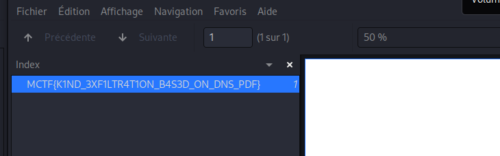

# ResolveMe

## Enoncé

> Notre NDR nous a remonté une alerte avec un tag  basé sur une tactique MITRE Attaack "Exfiltration". Par chance, j'ai réussi à dump la capture pcap depuis la console. 
> Votre mission, si vous l'accepter est d'investiguer et de comprendre ce qui a bien pu se passer.

## Solve

On a un fichier **pcap**, on ouvre le fichier avec wireshark

Avec wireshark `fichier > exporter objet > http > filename p4rt1`

```shell
$ cat p4rt1

JVBERi0xLjYKJcOkw7zDtsOfCjIgMCBvYmoKPDwvTG
[...]
```

On a de la base64, ave cyberchef on décode la base64 et on se retrouve avec un fichier **pdf**

On a juste à ouvrir le pdf pour avoir le flag 



**Flag : MCTF{K1ND_3XF1LTR4T1ON_BAS3D_ON_DNS_PDF}**


