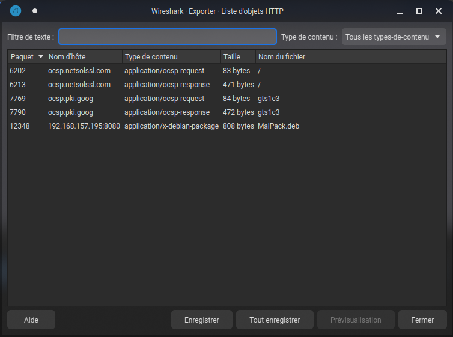

# Knock Knock

Difficulté : Intro

Author: Braguette

Catégorie : Forensics

## Enoncé

> We have to monitor our network every day to make sure our admins don't help players get out of the game.
> We are sending you a suspicious capture. Do your job !

## Solve

On a un fichier `.pcapng` qu'on ouvre avec Wireshark. Puis on va dans `Fichier > exporter objets > http` :



On extrait `MalPack.deb` et on effectue un **binwalk** dessus :

```shell
binwalk -e MalPack.deb                

DECIMAL       HEXADECIMAL     DESCRIPTION
--------------------------------------------------------------------------------
132           0x84            xz compressed data
512           0x200           xz compressed data
```

```shell
cd _MalPack.deb.extracted/
```

```shell
cat 200

./0000775000175000017500000000000014415757152010646 5ustar  remnuxremnux./usr/0000775000175000017500000000000014415757152011457 5ustar  remnuxremnux./usr/local/0000775000175000017500000000000014415757152012551 5ustar  remnuxremnux./usr/local/bin/0000775000175000017500000000000014416000302013274 5ustar  remnuxremnux./usr/local/bin/simplescript.sh0000775000175000017500000000005614416000302016352 0ustar  remnuxremnux#!/bin/bash

echo "PWNME{P4ck4g3_1s_g00d_ID}"
```

**Flag : PWNME{P4ck4g3_1s_g00d_ID}**