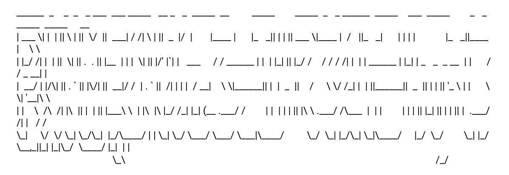
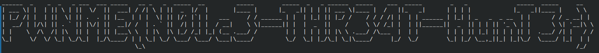

# TimmyIsDump

Difficulté : :star: :star:

Author: Braguette

Catégorie : Forensics

## Énoncé

> Our administrator Timmy is a bit of an idiot, but that's why we love him. However, he downloaded a script that did something weird to our Detention user database. Since we know he's not the brightest, we make sure to do regular memory dump. I know you are the best. Get the file

## Solve


```shell
tar xvf memory.tar.gz                         
output.lime
```

```shell
strings output.lime | grep -i 'Linux version' | uniq 

Linux version 4.2.6-200.fc22.x86_64 (mockbuild@bkernel02.phx2.fedoraproject.org) (gcc version 5.1.1 20150618 (Red Hat 5.1.1-4) (GCC) ) #1 SMP Tue Nov 10 16:45:19 UTC 2015
[...]
```

On a affaire avec un fedora 22.

On va devoir faire notre profile pour volatility.

### Création de profile

Il faut créer une VM Workstation fedora 22 : https://dl.fedoraproject.org/pub/archive/fedora/linux/releases/22/Workstation/x86_64/iso/. Lorsqu'on arrive sur la VM, avec la commande `uname`, on voit que nous avons la bonne version du système

```shell
uname -r
4.4.14-200.fc22.x86_64
```

Pour être assuré d'avoir un bon profile, on va installer la bonne version de `gcc` et installer les packages **rmp** afin d'avoir la bonne version de système :

```shell
dnf install gcc-5.1.1-1.fc22.x86_64.rpm --allowerasing
```

```shell
dnf install *.rpm

kernel-4.2.6-200.fc22.x86_64.rpm
kernel-core-4.2.6-200.fc22.x86_64.rpm
kernel-devel-4.2.6-200.fc22.x86_64.rpm
kernel-headers-4.2.6-200.fc22.x86_64.rpm
kernel-modules-4.2.6-200.fc22.x86_64.rpm
```

Sources :
- https://rpm.pbone.net/info_idpl_47654141_distro_fedora22_com_gcc-5.1.1-1.fc22.x86_64.rpm.html
- https://kojipkgs.fedoraproject.org/packages/kernel/4.2.6/200.fc22/x86_64/

Pour créer le profile :

```shell
dnf install zip libdwarf-tools -y
```

```bash
#!/bin/bash
git clone https://github.com/volatilityfoundation/volatility.git
cd volatility/tools/linux/
sed -i 's/$(shell uname -r)/4.2.6-200.fc22.x86_64/g' Makefile
make
cd ../../../
zip fedora22.zip ./volatility/tools/linux/module.dwarf /boot/System.map-4.2.6-200.fc22.x86_64
```

### Analyse

```shell
vol2d --plugins=/a/$(readlink -f plugins) -f /a/$(readlink -f output.lime) --profile=Linuxfedora22x64 linux_enumerate_files > files.txt
```

```shell
vol2d --plugins=/a/$(readlink -f plugins) -f /a/$(readlink -f output.lime) --profile=Linuxfedora22x64 linux_find_file -L > files_cached.txt
```

On sait que un script a été exécuter par un utilisateur donc on va chercher dans son répertoire et on trouve `Intelligence.sh` que l'on va dump :

```shell
vol2d --plugins=/a/$(readlink -f plugins) -f /a/$(readlink -f output.lime) --profile=Linuxfedora22x64 linux_find_file -i 0xffff88002a0520c0 -O /a/$(readlink -f out/script.sh)
```

Malheuresement, le contenu du fichier est inexploitable. On va essayer de trouver des informations à coup de `grep`.

```shell
grep -i -C 5 Intelligence.sh

sudo ./Intelligence.sh 
[sudo] Mot de passe de n3m3s1s
  adding: opt/confidential.pdf (deflated 76%)
 history -c
```

On a un nouveau fichier apparement important :

```shell
grep -i confidential.pdf strings.txt 
```

Avec le `grep`, on trouve ce qui ressemble à script bash (surement `Intelligence.sh`) et on apprend l'existance du fichier `/tmp/DecodeMe.lol` :

```bash
#!/bin/bash

function zipZeFile() {
    password=$(echo "$1" | cut -c 1-15)
    zip -P "$password" /tmp/DecodeMe.lol /opt/confidential.pdf
}

function Generate-Password() {
    confidentialFile="$1"
    shaSum=$(dd if=/dev/random bs=32 count=1 2>/dev/null | sha256sum | cut -d " " -f 1)
    aesIV=$(echo -n "$shaSum" | base64 | head -c 16)
    easKey=$(echo -n "$shaSum" | sha256sum | cut -d " " -f 1)
    encrypted=$(echo -n "hello world" | openssl enc -aes-256-cbc -K "$easKey" -iv "0123456789012345" -base64)
    key=$(echo -n "$password" | sha512sum | cut -d " " -f 1)
    zipZeFile "$key"
    shred -fuz $1
}

Generate-Password /opt/confidential.pdf
```

On dump le fichier `/tmp/DecodeMe.lol` :

```shell
vol2d --plugins=/a/$(readlink -f plugins) -f /a/$(readlink -f output.lime) --profile=Linuxfedora22x64 linux_find_file -i 0xffff88004cd314d8 -O /a/$(readlink -f out/decodeme.lol)
```

Comme on pouvait s'en douter, il s'agit bien zip avec mot de passe :

```shell
file out/decodeme.lol 
out/decodeme.lol: Zip archive data, at least v2.0 to extract, compression method=deflate
```

On va devoir trouver le mot de passe, pour cela on va rependre le script et afficher `$password` :

```bash
#!/bin/bash

function zipZeFile() {
    password=$(echo "$1" | cut -c 1-15)
    echo $password
}

function Generate-Password() {
    shaSum=$(dd if=/dev/random bs=32 count=1 2>/dev/null | sha256sum | cut -d " " -f 1)
    aesIV=$(echo -n "$shaSum" | base64 | head -c 16)
    easKey=$(echo -n "$shaSum" | sha256sum | cut -d " " -f 1)
    encrypted=$(echo -n "hello world" | openssl enc -aes-256-cbc -K "$easKey" -iv "0123456789012345" -base64)
    key=$(echo -n "$password" | sha512sum | cut -d " " -f 1)
    zipZeFile "$key"
}

Generate-Password
```

```shell
./get_password.sh
hex string is too short, padding with zero bytes to length
cf83e1357eefb8b
```

```shell
unzip out/decodeme.lol
Archive:  out/decodeme.lol
[out/decodeme.lol] opt/confidential.pdf password: # cf83e1357eefb8b
  inflating: opt/confidential.pdf   
```




```shell
strings extracts/opt/confidential.pdf
```




**Flag : PWNME{N01c3-THR34T-HunT3r}**